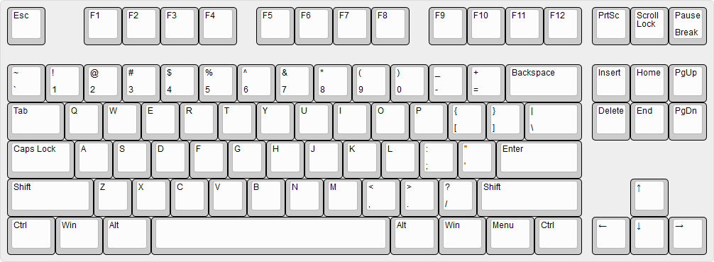

.. role:: texcode(code)
   :language: latex

.. highlight:: latex

.. _appx:CommandGlossary:

***********************
Σύμβολα και Εντολές
***********************


Σε αυτό το παράρτημα παραθέτουμε με τη μορφή οδηγού αναφοράς, τα σύμβολα και τις εντολές που μπορείτε να χρησιμοποιήσετε στη |latex|.

Τονίζεται ότι ο οδηγός περιλαμβάνει τα σύμβολα και εντολές στα οποία κάνουμε αναφορά στο βιβλίο. Δεν καλύπτει το σύνολο των υποστηριζόμενων από τα |tex| / |latex|. Σε καμία περίπτωση, οι λίστες που ακολουθούν, δεν είναι πλήρεις. Πολλά περισσότερα σύμβολα μπορείτε να βρείτε στο ....... Επίσης δεν περιλαμβάνονται και εντολές που εισάγονται από ανεξάρτητα πακέτα. Θα πρέπει να ανατρέξετε στην τεκμηρίωση του αντίστοιχου πακέτου για λεπτομέρειες.

Ο οδηγός έχει τη μορφή 'λεξικού εντολών' (glossary of commands) κατ΄ αναλογία με ένα 'λεξικό όρων' (glossary of terms). Κάθε όρος είναι μία εντολή (ή σύμβολο) από το 'λεξιλόγιο' της |latex|. Κάθε όρος συνοδεύεται από ένα σύντομο επεξηγηματικό κείμενο στο οποίο εξηγείται τι κάνει η συγκεκριμένη εντολή, αν υπάρχουν εναλλακτικές μορφές που παράγουν το ίδιο ή παραπλήσιο αποτελέσμα, τα βασικά χαρακτηριστικά της και, όπου κρίνεται αναγκαίο, κάποιον επιπλέον σχολιασμό. Όπου είναι εφικτό, εισάγονται και παραπομπές σε εξωτερικά έγγραφα ή πηγές για παραπέρα διερεύνηση.

Οι εντολές είναι ομαδοποιημένες σε ενότητες, ανάλογα με το ρόλο τους στην κατασκευή του εγγράφου (π.χ. εντολές που αφορούν σε γραμματοσειρές, εντολές που διαχειρίζονται το χώρο κ.λπ.). Οι επικεφαλίδες των ενοτήτων είναι αγγλικοί όροι (αν και στη συνέχεια οι όροι επεξηγούνται). Διατηρήθηκαν οι αγγλικοί όροι γιατί:

- Οι |tex| / |latex| είναι αμερικανικά προγράμματα, σχεδιασμένα εξαρχής να υποστηρίζουν στοιχειοθεσία αγγλικού κειμένου. Αν και σήμερα, η προσαρμογή τους σε σχεδόν κάθε γλώσσα του πλανήτη είναι σχετικά απλή, η ορολογία που χρησιμοποιείται παντού είναι η αγγλική (συγκεκριμένα η αμερικανική). Θεωρήσαμε πιο πρόσφορο να τη διατηρήσουμε για μεγαλύτερο κέρδος του αναγνώστη (χρησιμοποιήστε τους όρους που θα συναντήσετε, όταν ψάχνετε βοήθεια στο διαδίκτυο, θα δείτε τη διαφορά).
- Η προσαρμογή όλων των όρων στην ελληνική γλώσσα, δεν είναι πάντα εύκολη.

Οι περισσότερες εντολές είναι απλές σαν κατασκευές και συνεπώς είναι απλή και η περιγραφή τους. Κάποιες όμως έχουν σύνθετο χαρακτήρα (π.χ. επιδέχονται πολλαπλά ορίσματα) και η πλήρης περιγραφή τους δεν είναι εφικτή εδώ (θα χρειάζοντα βιβλία για να περιγραφούν πλήρως, όλες). Σε τέτοιες περιπτώσεις δίνονται όλες οι αναγκαίες πληροφορίες χρήσης τους και ταυτόχρονα γίνεται παραπομπή και σε άλλες πηγές, για εμβάθυνση. Σαν βάση αυτού του οδηγού χρησιμοποιήθηκε το `LaTeX2e unofficial reference manual <http://tug.org/texinfohtml/latex2e.html>`_ (έκδοση 2018) και οι περισσότερες παραπομπές από εδώ, γίνονται προς αυτό το κείμενο.

Από αυτόν τον οδηγό γίνονται επίσης παραπομπές και σε άλλα μέρη του βιβλίου. Οι παραπομπές αυτές όμως αφορούν σε ενότητες (π.χ. "δες 'Μαθηματικό κείμενο'" και όχι στα σημεία του βιβλίου (σελίδες), που εμφανίζονται οι εντολές. Τέτοιες παραπομπές μπορείτε να βρείτε στο *Ευρετήριο* (index) στο τέλος του βιβλίου, όπου όλοι οι όροι του οδηγού (σύμβολα και εντολές) είναι επίσης καταχωρημένοι.


.. _sec:Symbols:

Symbols
=========
Χρησιμοποιήστε την :numref:`img:KeyboardLayout` στη συνέχεια, όταν θέλετε να εντοπίσετε ένα χαρακτήρα - σύμβολο που αναφέρεται στον οδηγό. Χρησιμοποιήστε επίσης την ίδια εικόνα σαν οδηγό όταν θέλετε να εντοπίσετε τον ίδιο χαρακτήρα στο δικό σας πληκτρολόγιο.



   Τυπικό πληκτρολόγιο υπολογιστή υπολογιστή (QWERTY)
   
   Εξοικιωθείτε με τους χαρακτήρες και τα σύμβολα που βλέπετε και εντοπίστε τα στο δικό σας πληκτρολόγιο. Στα πλήκτρα που φιλοξενούν δύο χαρακτήρες (πάνω-κάτω ή αριστερά-δεξιά), ο πάνω (ή αριστερά) χαρακτήρας επιλέγεται με :kbd:`Shift+Πλήκτρο` και ο κάτω (ή δεξιά) απλά πατώντας το πλήκτρο.

Τα σύμβολα στη |latex| έχουν πολλαπλούς ρόλους ανάλογα με το πως εισάγονται. Συγκεκριμένα, τα σύμβολα που περιγράφονται στη συνέχεια χωρίζονται σε τρεις κατηγορίες:

- Σύμβολα που βρίσκονται ήδη στο :ref:`πληκτρολόγιό <sec:BuildinSymbols>` σας.
- Σύμβολα που δε βρίσκονται στο πληκτρολόγιο αλλά παράγονται με :ref:`εντολές κειμένου <sec:TextSymbols>`.
- Σύμβολα (του πληκτρολογίου) που χρησιμοποιούνται :ref:`σαν εντολές <sec:ControlSymbolSymbols>`. Αυτά είναι μία από τις μορφές εντολών της |latex| (δες ':ref:`sec:ControlSymbol`').

.. rubric:: Περισσότερες πηγές

Τα σύμβολα που περιγράφονται στη συνέχεια αναγνωρίζονται εγγενώς από τη |latex| (δε χρειάζονται βοηθητικά πακέτα). Για περισσότερες επιλογές ανατρέξτε στον 'απόλυτο' οδηγό συμβόλων '`The Comprehensive LATEX Symbol List <http://tug.ctan.org/info/symbols/comprehensive/symbols-a4.pdf>`_' όπου θα βείτε όλα τα διαθέσιμα σύμβολα και τα πακέτα που τα εισάγουν. Εναλλακτικά, από γραμμή εντολών:

.. code-block:: latex
   :class: .commandshell

   > texdoc symbols-a4
 
.. _sec:BuildinSymbols:

Build-in Symbols (keyboard)
---------------------------------------

Χρησιμοποιήστε τον :numref:`tab:KeyboardSymbols` που ακολουθεί, σαν οδηγό γρήγορης αναφοράς, για να εντοπίσετε το symbol που σας ενδιαφέρει. Μεταβείτε στην αντίστοιχη καταχώριση για περισσότερες πληροφορίες.


.. list-table:: Σύμβολα (S) διαθέσιμα στο πληκτρολόγιο
   :name: tab:KeyboardSymbols
   :header-rows: 1
   :align: center
   :width: 100%
   :widths: 15 35 15 35
   :class: longtable

   * - | S
     - | Περιγραφή
     - | S
     - | Περιγραφή

   * - | :term:`\!`
     - | exclamation mark
     - | :term:`$`
     - | dollar symbol

   * - | :term:`#`
     - | hash symbol
     - | :term:`%`
     - | percent symbol

   * - | :term:`\` <\`>`
     - | left quote
     - | :term:`\'`
     - | right quote

   * - | :term:`(`
     - | left parenthesis
     - | :term:`)`
     - | right parenthesis

   * - | :term:`[`
     - | left square bracket
     - | :term:`]`
     - | right square bracket

   * - | :term:`{`
     - | left curly brace
     - | :term:`}`
     - | left curly brace

   * - | :term:`\\`
     - | backslash
     - | :term:`/`
     - | forward slash (or slash)

   * - | :term:`\_`
     - | underscore
     - | :term:`&`
     - | ambersand

   * - | :term:`|`
     - | vertical bar
     - | :term:`~`
     - | tild

   * - | :term:`-`
     - | dash
     - | :term:`--`
     - | en-dash

   * - | :term:`---`
     - | em-dash
     - | :term:`@`
     - | χρήση σε περιβάλλον πίνκακα


.. glossary::
   :sorted:


   ``@``
      :Σύνταξη:
         .. code-block::

            % σε περιβάλλον πίνακα
            @{<text>}

            % σε μακροεντολές
            \@<CommandName>

      :Περιγραφή:
         Σύμβολο *at*. Σε περιβάλλον πίνακα και στη χρήση μακροεντολών.
      :Ορίσματα:
         .. describe:: text

         Υποχρεωτικό. Κείμενο που εισάγεται μεταξύ στηλών. Μπορεί να είναι και ο κενός χαρακτήρας.
      :Σχόλια:
         Χρησιμοποιείται κυρίως σε περιβάλλον πίνακα (π.χ. `tabular`) για την εισαγωγή κειμένου `text` μεταξύ των στηλών. Για περισσότερες λεπτομέρειες δες περιβάλλον :term:`\\tabular <tabular>` και :numref:`tab:TabularSpecifiers`.

         Μία άλλη χρήση του είναι στη δημιουργία μακρεντολών. Πολλές εντολές της |latex| ορίζονται στον πυρήνα της περιλαμβάνοντας και αυτόν τον χαρακτήρα, στο όνομα της εντολής. Όταν η εντολή χρησιμοποιείται στο κείμενο, ο συγκεκριμένος χαρακτήρας αγνοείται. Όταν ο χρήστης προσπαθήσει να αλλάξει (επαναπρογραμματίσει) την εντολή, ο χαρακτήρας ενεργοποιείται και η |latex| παράγει μήνυμα αποτροπής. Ο λόγος της ύπαρξής του δηλαδή είναι να 'προστατεύει' τις μακροεντολές από λανθασμένους χειρισμούς του χρήστη. Αν σκόπιμα θέλετε να αλλάξετε μία εντολή πρέπει να το κάνετε μεταξύ των εντολών :term:`\\makeatletter <makeatletter>` και :term:`\\makeatother <makeatother>` (αλλάζουν και επαναφέρουν αντίστοιχα, την ιδιότητα του `@`).
      :Εναλλακτικά:


   ``-``
      :Σύνταξη:
      :Περιγραφή:
         Σύμβολο *παύλα* ή *μείον* (dash, minus sign)
      :Ορίσματα:
      :Σχόλια:
         Χρησιμοποιείται στο :ref:`συλλαβισμό <sec:Hyphanation>` ή απλά σαν παύλα (text mode) και σαν το σύμβολο της αφαίρεσης (math mode).
      :Εναλλακτικά:


   ``--``
      :Σύνταξη:
         .. code-block:: latex

            % γενικά
            --

            % παράδειγμα
            δες σελίδες 12 -- 18

      :Περιγραφή:
         Σύμβολο *en-dash* (δύο παύλες)
      :Ορίσματα:
      :Σχόλια:
         Χρησιμοποιείται κατά βάση όταν θέλουμε να υποδείξουμε εύρη (δες παράδειγμα).

         Εισάγεται σαν δύο συνεχόμενες παύλες `--` και εμφανίζεται σαν μία παύλα, λίγο μεγαλύτερη από την :term:`-` (dash) και λίγο μικρότερη από την :term:`---` (em-dash).

      :Εναλλακτικά:
         :term:`\\textendash <textendash>`


   ``---``
      :Σύνταξη:
         .. code-block:: latex

            % γενικά
            ---

            % παράδειγμα
            Η LaTeX --- ή πιο σωστά τα TeX \ LaTeX --- είναι ένα
            σύστημα προετοιμασίας εγγράφων.
      :Περιγραφή:
         Σύμβολο *em-dash* (τρεις παύλες)
      :Ορίσματα:
      :Σχόλια:
         Χρησιμοποιείται σαν σημείο στίξης, όταν θέλουμε να κάνουμε μία επεξήγηση μέσα σε μία πρόταση (δες παράδειγμα).
         
         Εισάγεται σαν τρεις συνεχόμενες παύλες `---` και εμφανίζεται σαν μία παύλα, μεγαλύερη από την :term:`--` (em-dash) και ακόμη μεγαλύτερη από την :term:`-` (dash).
      :Εναλλακτικά:
         :term:`\\textemdash <textemdash>`


   ``\``
      :Σύνταξη:
      :Περιγραφή:
         :ref:`Δεσμευμένος χαρακτήρας <sec:ReservedCharacters>` backslash.
      :Ορίσματα:         
      :Εναλλακτικά:   
      :Σχόλια:
         Σχεδόν όλες οι εντολές της |latex| εισάγονται με το συγκεκρμένο χαρακτήρα-σύμβολο. Επιπλέον, είναι και χαρακτήρας διαφυγής για τους δεσμευμένους χαρακτήρες.

         Για αποδέσμευση χρησιμοποιήστε την εντολή :term:`\\textbackslash <textbackslash>`.

   
   ``/``
      :Σύνταξη:
      .. code-block:: latex

            % μαθηματικός οριοθέτης
            $A/B$

            % διαχωριστικό καταλόγων
            https://www.ctan.org/

            % σύμβολο slash
            ναι/όχι

      :Περιγραφή:
         Έχει πολλαπlές χρήσεις:
         - Σε math mode είναι οριοθέτης.
         - Χρησιμοποιείται για να διαχωρίζει καταλόγους ή/και φακέλους.
         - Σαν απλό σύμβολο slash (text mode).
      :Ορίσματα: Όχι    
      :Σχόλια:
         Σε text mode χρησιμοποιήστε την εντολή `\\slash` η οποία επιτρέπει αλλαγή γραμμής στο σημείο εισαγωγής (π.χ. :texcode:`ναι\\slash όχι` αντί για :texcode:`ναι/όχι`).
      :Εναλλακτικά:
         :term:`\\slash <slash>`


   ``^``
      :Σύνταξη:
         .. code-block:: latex

            ^{<math>}

      :Περιγραφή:
         :ref:`Δεσμευμένος χαρακτήρας <sec:ReservedCharacters>` caret (ή hat). Εμφανίζει το όρισμά του `math` σαν εκθέτη (superscript). Λειτουργεί μόνο σε math mode.
      :Ορίσματα:
         .. describe:: math

         Υποχρεωτικό. Το (μαθηματικό) κείμενο που θα εμφανιστεί σαν εκθέτης.
      :Εναλλακτικά:
         :term:`\\sp <sp>`   
      :Σχόλια:
         Για αποδέσμευση χρησιμοποιήστε την εντολή :term:`\\textasciicircum <textasciicircum>`.


   ``|``
      :Σύνταξη:
      :Περιγραφή:
         Οριοθέτης (delimeter) σε math mode, προσδιοριστής (specifier) στήλης σε περιβάλλον πίνακα.
      :Ορίσματα:
         Όχι
      :Εναλλακτικά:
         1. Σε text mode, χρησιμοποιήστε την εντολή :term:`\\textbar <textbar>`.
         2. Σε περιβάλλον πίνακα, η εντολή :term:`\\vline <vline>` (συνώνυμο, χρησιμοποιείται σπάνια)   
      :Σχόλια:
         Σε μαθηματικό κείμενο χρησιμοποιείται για να υποδείξει όρισμα (π.χ. απόλυτη τιμή). Σε περιβάλλον πίνακα, είναι ένας από τους προσδιοριστές στηλών, υποδέικνύει τη δημιουργία κάθετης γραμμής κατά μήκος μίας στήλης (δες :numref:`tab:TabularSpecifiers`).


   ``$``
      :Σύνταξη:
         .. code-block:: latex

            $<math>$

      :Περιγραφή:
         :ref:`Δεσμευμένος χαρακτήρας <sec:ReservedCharacters>` dollar.
      :Ορίσματα:  
      :Εναλλακτικά:
         1. :term:`\\begin{math} <math>` (περιβάλλον)
         2. :term:`\\(` (συντόμευση)   
      :Σχόλια:
         Δηλώνει την έναρξη και τη λήξη εισαγωγής inline μαθηματικού κειμένου. Χρησιμοποιείται πάντα σε ζεύγη (ένα στην έναρξη, ένα στη λήξη). Είναι συντόμευση του περιβάλλοντος :term:`\\begin{math} <math>`

         Για αποδέσμευση χρησιμοποιήστε την εντολή :term:`\\$`.


   ``#``
      :Σύνταξη:
      :Περιγραφή:
         :ref:`Δεσμευμένος χαρακτήρας <sec:ReservedCharacters>` hash.
      :Ορίσματα:
      :Εναλλακτικά:   
      :Σχόλια:
         Το συγκεκριμένο σύμβολο χρησιμοποιείται μόνο στη δημιουργία νέων μακροεντολών, στη μορφή `#<digit>` Για παράδειγμα, η μορφή `#2` υποδεικνύει το κείμενο που θα αντικαθιστά τη δεύτερη παράμετρο (όρισμα) μίας (νέας) έντολής. Περισσότερες λεπτομέρειες στην ενότητα '... δημιουργία εντολών ...'.

         Για αποδέσμευση χρησιμοποιήστε την εντολή :term:`\\#`.


   ``_``
      :Σύνταξη:
         .. code-block:: latex

            _{<math>}

      :Περιγραφή:
         :ref:`Δεσμευμένος χαρακτήρας <sec:ReservedCharacters>` *κάτω παύλα* (underscore). Εμφανίζει το όρισμά του `math` σαν δείκτη (subscript). Λειτουργεί μόνο σε math mode.
      :Ορίσματα:
         .. describe:: math

         Υποχρεωτικό. Το (μαθηματικό) κείμενο που θα εμφανιστεί σαν δείκτης. 
      :Σχόλια:
         Για αποδέσμευση χρησιμοποιήστε την εντολή :term:`\\_`. Αν θέλετε το χαρακτήτα σαν σύμβολο σε text mode, χρησιμοποιήστε την εναλλακτική εντολή `\\textunderscore`
      :Εναλλακτικά:
        - :term:`\\sb <sb>`
        - :term:`\\textunderscore <textunderscore>`


   ``~``
      :Σύνταξη:
         .. code-block:: latex

            % γενικά
            A~B

            % παράδειγμα
            Παπαδόπουλος~Ι. Νικόλαος

      :Περιγραφή:
         :ref:`Δεσμευμένος χαρακτήρας <sec:ReservedCharacters>` (tilde). Εισάγει αδιάρρηκτο διάστημα μεταξύ χαρακτήρων.
      :Ορίσματα:
         .. describe:: math

         Υποχρεωτικό. Το (μαθηματικό) κείμενο που θα εμφανιστεί σαν δείκτης. 
      :Σχόλια:
         Στο παράδειγμα, τα 'Ι.' και 'Παπαδόπουλος', θα διατηρηθούν μαζί, σε αλλαγή γραμμής και αλλαγή σελίδας.
         
         Για αποδέσμευση χρησιμοποιήστε την εντολή :term:`textasciitilde`.
      :Εναλλακτικά:


   ``%``
      :Σύνταξη:
      :Περιγραφή:
         :ref:`Δεσμευμένος χαρακτήρας <sec:ReservedCharacters>` *ποσοστό* (percent). Ότι ακολουθεί το συγκεκριμένο χαρακτήρα στο αρχείο εισόδου, δε θα ληφθεί υπόψη στην επεξεργασία και δε θα εμφανιστεί στο αρχείο εξόδου.
      :Ορίσματα:
      :Σχόλια:
         Για αποδέσμευση χρησιμοποιήστε την εντολή :term:`\\%`.  Χρήσιμο για την τεκμηρίωση κώδικα.
      :Εναλλακτικά:
         Πακέτο :texpkg:`comment`.


   ``&``
      :Σύνταξη:
      :Περιγραφή:
         :ref:`Δεσμευμένος χαρακτήρας <sec:ReservedCharacters>` (ambersand). Χρησιμοποιείται για να διαχωρίζει το περιεχόμενο ενός πίνακα σε στήλες, σε όλα τα περιβάλλοντα πίνακα.
      :Ορίσματα:
      :Σχόλια:
         Για αποδέσμευση χρησιμοποιήστε την εντολή :term:`\\&`.      
      :Εναλλακτικά:

   
   ``(``
      :Σύνταξη:
      :Περιγραφή:
         Χαρακτήρας *αριστερή παρένθεση* (left parenthesis). Σε text mode εισάγει απλά το σύμβολο αριστερής παρένθεσης. Σε math mode εισάγει το μαθηματικό σύμβολο αριστερής παρένθεσης (round bracket).
      :Ορίσματα:
      :Σχόλια:
         Συνοδεύεται από το αντίστοιχο σύμβολο ( :term:`)` ).
      :Εναλλακτικά:


   ``)``
      :Σύνταξη:
      :Περιγραφή:
         Χαρακτήρας *δεξιά παρένθεση* (right parenthesis)
      :Ορίσματα:
      :Εναλλακτικά:         
      :Σχόλια:
         Δες ( :term:`(` ) 


   ``{``
      :Σύνταξη:
         .. code-block:: latex

            % υποχρεωτικό όρισμα εντολών
            \<CommandName>{<MandatoryArgument>}

            % ομαδοποίηση
            {text ... \<command> ... text ... etc}
      :Περιγραφή:
         :ref:`Δεσμευμένος χαρακτήρας <sec:ReservedCharacters>` *left curly brace* (αριστερό άγκιστρο). Για αποδέσμευση χρησιμοποιήστε την εντολή ( :term:`\\{` ).

         Εισάγει υποχρεωτικά ορίσματα εντολών ή υποδυκνύει ομαδοποίηση ή απλά σύμβολο αριστερό άγκιστρο σε μαθηματικό κείμενο.

      :Ορίσματα:
         Όχι

      :Εναλλακτικά:
         - Για ομαδοποίηση :term:`\\bgroup <bgroup>`
         - Σαν απλό χαρακτήρα (text mode) :term:`\\textbraceleft <textbraceleft>` ή ( :term:`\\{` )

      :Σχόλια:
         Όταν ακολουθεί αμέσως μετά από το όνομα μίας εντολή ή αμέσως μετά από τα προαιρετικά ορίσματα μίας εντολής (σύμβολα :term:`[` και :term:`]`), οριοθετεί το υποχρεωτικό όρισμα της εντολής (π.χ. `\\textbf{κείμενο που θα μετατραπεί σε boldface}`. Όταν χρησιμοποιείται αλλού, σηματοδοτεί την έναρξη ομαδοποίησης (π.χ. `{\\bfseries κείμενο που θα μετατραπεί σε boldface}`). Σε κάθε περίπτωση συνοδεύεται από το χαρακτήρα ( :term:`}` ).


   ``}``
      :Σύνταξη:
      :Περιγραφή:
         :ref:`Δεσμευμένος χαρακτήρας <sec:ReservedCharacters>` *right curly brace* (δεξιό άγκιστρο). Για αποδέσμευση χρησιμοποιήστε την εντολή ( :term:`\\}` ).
      :Ορίσματα:
      :Εναλλακτικά:
         - Για ομαδοποίηση :term:`\\egroup <egroup>`
         - Σαν απλό χαρακτήρα (text mode) :term:`\\textbraceright <textbraceright>` ή ( :term:`\\}` )
      :Σχόλια:
          Λοιπά όπως ( :term:`{` ).


   ``[``
      :Σύνταξη:

         .. code-block:: latex

            % οριοθέτης προαιρετικών ορισμάτων
            \command[<optional arg]>{<mandatory arg>}

            % σύμβολο αριστερή αγκύλη (text mode)
            text and [text]

            % οριοθέτης displayed math (math mode)
            \[ y = mx + c \]

            %μαθηματικό σύμβολο αριστερή αγκύλη
            \[
            \left[  \frac{ N } { \left( \frac{L}{p} \right)
              - (m+n) }  \right]
            \]

      :Περιγραφή:
         Χαρακτήρας *left square bracket* (αριστερή αγκύλη). Έχει τις παρακάτω χρήσεις:

         1. Οριοθέτης έναρξης προαιρετικών ορισμάτων.
         2. Σε text mode, σύμβολο αριστερής αγκυλης.
         3. Σε math mode, οριοθέτης displayed math. Σε αυτή την περίπτωση εισάγεται με τα control symbols ( :term:`\\[` ) και ( :term:`\\]` ).
         4. Σε math mode, μαθηματικό σύμβολο αγκύλης. Σε αυτές τις περιπτώσεις εισάγεται με τις εντολές :term:`\\left <left>` και :term:`\\right <right>`
      :Ορίσματα:
      :Σχόλια:
      :Εναλλακτικά:


   ``]``
      :Σύνταξη:
      :Περιγραφή:
         Χαρακτήρας *right square bracket* (δεξιά αγκύλη).
      :Ορίσματα:
      :Εναλλακτικά:         
      :Σχόλια:
         Δες  ( :term:`[` )
  

   ``!``
      :Σύνταξη:
      :Περιγραφή:
         Σημείο στίξης θαυμαστικό (exclamation mark) ( `!` ).
      :Ορίσματα:
      :Εναλλακτικά:         
      :Σχόλια:
   

   `````
      :Σύνταξη:
      :Περιγραφή:
         Μονό αριστερό εισαγωγικό (left single quote).
      :Ορίσματα:
      :Σχόλια:
         Βρίσκεται στο πλήκτρο κάτω ακριβώς από το πλήκτρο :kbd:`Esc` (συνήθως επιλέγεται με :kbd:`Shift+Esc`, δες :numref:`img:KeyboardLayout`).

         Όταν εισάγεται μία φορά από το πληκτρολόγιο, δημιουργεί το μονό αριστερό εισαγωγικό (left quote). Στην εκτύπωση μοιάζει με τον αριθμό έξι ( |lsquo| ).

         Όταν εισάγεται δύο φορές από το πληκτρολόγιο, δημιουργεί τα διπλά αριστερά εισαγωγικά (double left quotes). Στην εκτύπωση μοιάζει με τον αριθμό εξήντα έξι ( |ldquo| ).
      :Εναλλακτικά:
         - :term:`\\textquoteleft <textquoteleft>`
         - :term:`\\lq <lq>`
         - :term:`\\textquotedblleft <textquotedblleft>` (διπλά αριστερά εισαγωγικά)
 

   ``'``
      :Σύνταξη:
      :Περιγραφή:
         Μονό δεξιό εισαγωγικό (right single quote).
      :Ορίσματα:
      :Σχόλια:
         Βρίσκεται στο πλήκτρο ακριβώς αριστερά από το πλήκτρο :kbd:`Enter` (δες :numref:`img:KeyboardLayout`).

         Όταν εισάγεται μία φορά από το πληκτρολόγιο, δημιουργεί το μονό δεξιό εισαγωγικό (right quote). Στην εκτύπωση μοιάζει με τον αριθμό εννιά ( |rsquo| ).

         Όταν εισάγεται δύο φορές από το πληκτρολόγιο, δημιουργεί τα διπλά δεξιά εισαφωγικά (double right quotes). Στην εκτύπωση μοιάζει με τον αριθμό ενενήντα εννιά ( |rdquo| ).
      :Εναλλακτικά:
         - :term:`\\textquoteright <textquoteright>`
         - :term:`\rq <rq>`
         - :term:`\\textquotedblright <textquotedblright>` (διπλά δεξιά εισαγωγικά)


.. _sec:TextSymbols:

Text Symbols (commands)
--------------------------------------------

Χρησιμοποιήστε τον :numref:`tab:TextSymbols` που ακολουθεί, σαν οδηγό γρήγορης αναφοράς, για να εντοπίσετε το σύμβολο που σας ενδιαφέρει και την αντίστοιχη εντολή που τον παράγει. Μεταβείτε στην αντίστοιχη καταχώριση για περισσότερες πληροφορίες.

.. list-table:: Σύμβολα που παράγονται από Control Words (CW)
   :name: tab:TextSymbols
   :header-rows: 1
   :align: center
   :width: 100%
   :widths: 20 30 20 30
   :class: longtable

   * - | CW
     - | Εισάγει |hellip|
     - | CW
     - | Εισάγει |hellip|

   * - | :term:`\\sb{\<subscript\>} <sb>`
     - | |hellip| το `subscript` σαν δείκτη
     - | :term:`\\sp{\<superscript\>} <sp>`
     - | |hellip| το `supercript` σαν εκθέτη

   * - | :term:`\\textasciicircum <textasciicircum>`
     - | |hellip| το ( :term:`^` )
     - | :term:`\\textasciitilde <textasciitilde>`
     - | |hellip| το ( :term:`~` )

   * - | :term:`\\textbackslash <textbackslash>`
     - | |hellip| το ( :term:`\\` )
     - | :term:`\\copyright <copyright>`
       | :term:`\\textcopyright <textcopyright>`
     - | |hellip| το σύμβολο copyright
       | ( |copy| )

   * - | :term:`\\textregistered <textregistered>`
     - | |hellip| το σύμβολο καταχώρισης (registered)
       | ( |reg| )
     - | :term:`\\texttrademark <texttrademark>`
     - | |hellip| το σύμβολο εμπορικού σήματος (trade mark)
       | ( |trade| )

   * - | :term:`\\dag <dag>`
       | :term:`\\dagger <dagger>`
     - | |hellip| το σύμβολο dagger
       | ( |dagger| )
     - | :term:`\\ddag <ddag>`
       | :term:`\\ddagger <ddagger>`
       | :term:`\\textdaggerdbl <textdaggerdbl>`
     - | |hellip| το σύμβολο double dagger
       | ( |Dagger| )
   
   * - | :term:`\\textless <textless>`
       | :term:`\\textgreater <textgreater>`
     - | |hellip| τα σύμβολα *μικρότερο από* και *μεγαλύτερο από*, αντίστοιχα
       | ( |lt| |gt| ) 
     - | :term:`\\langle <langle>`
       | :term:`\\rangle <rangle>`
     - | |hellip| γωνιακές αγκύλες (αριστερή, δεξιά, αντίστοιχα) 
       | ( |lanbr| |ranbr| )

   * - | :term:`\\\guillemetleft <\guillemetleft>`
       | :term:`\\\guillemetright <\guillemetright>`
     - | |hellip| διπλά αριστερά και δεξιά, γωνιακά εισαγωγικά, αντίστοιχα
       | ( |laquo| |raquo| )
     - | :term:`\\guilsinglleft <guilsinglleft>`
       | :term:`\\guilsinglright <guilsinglright>`
     - | |hellip| μονά αριστερά και δεξιά, γωνιακά εισαγωγικά, αντίστοιχα
       | ( |laquos| |raquos| )

   * - | :term:`\\dots <dots>`
       | :term:`\\ldots <ldots>`
       | :term:`\\ellipsis <ellipsis>`
       | :term:`\\textellipsis <textellipsis>`
     - | ... το σύμβολο *τρεις τελείες*
       | ( |hellip| )
     - | :term:`\\pounds <pounds>`
       | :term:`\\textsterling <textsterling>`
     - | ... το σύμβολο της αγγλικής λίρας
       | ( |pound| )

   * - | :term:`\\lq <lq>`
       | :term:`\\textquoteleft <textquoteleft>`
     - | |hellip| το αριστερό μονό εισαγωγικό
       | ( |lsquo| )
     - | :term:`\\rq <rq>`
       | :term:`\\textquoteright <textquoteright>`    
     - | |hellip| το δεξιό μονό εισαγωγικό
       | ( |rsquo| )

   * - | :term:`\\textquotedblleft <textquotedblleft>`
     - | |hellip| διπλά αριστερά εισαγωγικά
       | ( |ldquo| )
     - | :term:`\\textquotedblright <textquotedblright>`    
     - | |hellip| διπλά δεξιά εισαγωγικά
       | ( |rdquo| )
   
   * - | :term:`\\S <S>`
       | :term:`\\textsection <textsection>`
     - | |hellip| το σύμβολο της (βιβλιογραφικής) ενότητας
       | ( |sect| )
     - | :term:`\\P <P>`
       | :term:`\\textparagraph <textparagraph>`
     - | |hellip| το σύμβολο της (βιβλιογραφικής) παραγράφου
       | ( |para| )

   * - | :term:`\\textbraceleft <textbraceleft>`
     - | |hellip| το σύμβολο αριστερό άγκιστρο
       | ( { )
     - | :term:`\\textbraceright <textbraceright>`
     - | |hellip| το σύμβολο δεξιό άγκιστρο
       | ( } )
   
   * - | :term:`\\textbar <textbar>`
     - | |hellip| το σύμβολο *κάθετη μπάρα*
       | ( |verbar| )
     - | :term:`\\textbullet <textbullet>`
     - | |hellip| το σύμβολο *κουκκίδα* (bullet)
       | ( |middot| )

   * - | :term:`\\textdollar <textdollar>`
     - | |hellip| το σύμβολο *δολλάριο* (dollar)
       | ( |dollar| )
     - | :term:`\\texteuro <texteuro>`
     - | |hellip| το σύμβολο *ευρό* (euro)
       | ( |euro| )

   * - | :term:`\\textleftarrow <textleftarrow>`
       | :term:`\\textrightarrow <textrightarrow>`
     - | |hellip| τα σύμβολα αριστερό και δεξιό βέλος αντίστοιχα
       | ( |larr| |rarr| )
     - | :term:`\\textunderscore <textunderscore>`
     - | |hellip| το σύμβολο *κάτω παύλα* (underscore)
       | ( |lowbar| )

   * - | :term:`\\slash <slash>`
     - | |hellip| το σύμβολο *διαίρεσης* (slash)
       | ( |sol| )
     - |
     - | 

   * - | :term:`\\textendash <textendash>`
     - | |hellip| το σύμβολο *en-dash*
       | ( |endash| )
     - | :term:`\\textemdash <textemdash>`
     - | |hellip| το σύμβολο *em-dash*
       | ( |emdash| )

Τα σύμβολα που φαίνονται στον :numref:`tab:TextSymbols` και περιγράφονται στη συνέχεια, αναγνωρίζονται άμεσα από τη |latex|, χωρίς βοηθητικά πακέτα. Πολλά περισσότερα σύμβολα είναι διαθέσιμα μέσω βοηθητικών πακέτων. Ανατρέξτε στις πηγές που παρατίθενται στην αρχική ενότητα ':ref:`sec:Symbols`' για περισσότερες επιλογές.


.. glossary::
   :sorted:


   ``textemdash``
      :Σύνταξη:
      :Περιγραφή:
         Εισάγει το σύμβολο *em-dash* ( |mdash| ).
      :Ορίσματα:
         Όχι      
      :Εναλλακτικά: ( :term:`---` )
      :Σχόλια:


   ``textendash``
      :Σύνταξη:
      :Περιγραφή:
         Εισάγει το σύμβολο *en-dash* ( |ndash| ).
      :Ορίσματα:
         Όχι      
      :Εναλλακτικά: ( :term:`--` )
      :Σχόλια:


   ``slash``
      :Σύνταξη:
      :Περιγραφή:
         Εισάγει το σύμβολο *διαίρεσης* (slash,  |sol| ).
      :Ορίσματα:
         Όχι      
      :Εναλλακτικά: ( :term:`/` )
      :Σχόλια:

   
   ``textunderscore``
      :Σύνταξη:
      :Περιγραφή:
         Εισάγει το δεσμευμένο χαρακτήρα underscore ( :term:`\_` ) για χρήση σε text mode.
      :Ορίσματα: Όχι      
      :Εναλλακτικά:
      :Σχόλια:
         :term:`\_` (math mode)


   ``textregistered``
      :Σύνταξη:
      :Περιγραφή:
         Εισάγει το σύμβολο καταχώρισης ( |reg| )
      :Ορίσματα: Όχι  
      :Σχόλια:
      :Εναλλακτικά:


   ``texttrademark``
      :Σύνταξη:
      :Περιγραφή:
         Εισάγει το σύμβολο εμπορικού σήματος ( |trade| )
      :Ορίσματα: Όχι  
      :Σχόλια:
      :Εναλλακτικά:


   ``langle``
      :Σύνταξη:
      :Περιγραφή:
         Εισάγει αριστερή γωνιακή αγκύλη ( |lanbr| ). Μόνο σε math mode
      :Ορίσματα: Όχι  
      :Σχόλια:
      :Εναλλακτικά:


   ``rangle``
      :Σύνταξη:
      :Περιγραφή:
         Εισάγει δεξιά γωνιακή αγκύλη ( |ranbr| ). Μόνο σε math mode
      :Ορίσματα: Όχι  
      :Σχόλια:
      :Εναλλακτικά:


   ``textrightarrow``
      :Σύνταξη:
      :Περιγραφή:
         Εισάγει το σύμβολο *αριστερό βέλος* ( |rarr| ).
      :Ορίσματα: Όχι  
      :Σχόλια:
      :Εναλλακτικά:


   ``textleftarrow``
      :Σύνταξη:
      :Περιγραφή:
         Εισάγει το σύμβολο *αριστερό βέλος* ( |larr| ).
      :Ορίσματα: Όχι  
      :Σχόλια:
      :Εναλλακτικά:


   ``textless``
      :Σύνταξη:
      :Περιγραφή:
         Εισάγει το (μαθηματικό) σύμβολο *μικρότερο από* ( |lt| ).
      :Ορίσματα: Όχι  
      :Σχόλια:
      :Εναλλακτικά:


   ``textgreater``
      :Σύνταξη:
      :Περιγραφή:
         Εισάγει το (μαθηματικό) σύμβολο *μεγαλύτερο από* ( |gt| ).
      :Ορίσματα: Όχι  
      :Σχόλια:
      :Εναλλακτικά:


   ``textdollar``
      :Σύνταξη:
      :Περιγραφή:
         Εισάγει το σύμβολο *δολλάριο* (dollar, |dollar| ).
      :Ορίσματα: Όχι  
      :Σχόλια:
      :Εναλλακτικά:


   ``texteuro``
      :Σύνταξη:
      :Περιγραφή:
         Εισάγει το σύμβολο *ευρό* (euro, |euro| ).
      :Ορίσματα: Όχι  
      :Σχόλια:
      :Εναλλακτικά:


   ``textbullet``
      :Σύνταξη:
      :Περιγραφή:
         Εισάγει το σύμβολο *κουκκίδα* ( |middot| ).
      :Ορίσματα: Όχι  
      :Σχόλια:
      :Εναλλακτικά:


   ``textbar``
      :Σύνταξη:
      :Περιγραφή:
         Εισάγει το σύμβολο *κάθετη μπάρα* ( | ).
      :Ορίσματα: Όχι  
      :Σχόλια:
      :Εναλλακτικά:
         Δες ( :term:`|` )


   ``textbraceleft``
      :Σύνταξη:
      :Περιγραφή:
         Εισάγει το σύμβολο αριστερό άγκιστρο ( { ).
      :Ορίσματα: Όχι  
      :Σχόλια:
      :Εναλλακτικά:
         Δες ( :term:`\\{ <\{>` )


   ``textbraceright``
      :Σύνταξη:
      :Περιγραφή:
         Εισάγει το σύμβολο δεξιό άγκιστρο ( } )..
      :Ορίσματα: Όχι  
      :Σχόλια:
      :Εναλλακτικά:
         Δες ( :term:`\\} <\}>` )


   ``P``
      :Σύνταξη:
      :Περιγραφή:
         Εισάγει το σύμβολο της βιβλιογραφικής παραγράφου ( |para| ).
      :Ορίσματα: Όχι  
      :Σχόλια:
      :Εναλλακτικά:
         Δες ( :term:`\\textparagraph <textparagraph>` )


   ``textparagraph``
      :Σύνταξη:
      :Περιγραφή:
         Εισάγει το σύμβολο της βιβλιογραφικής παραγράφου ( |para| ).
      :Ορίσματα: Όχι  
      :Σχόλια:
      :Εναλλακτικά:
         Δες ( :term:`\\P <P>` )


   ``S``
      :Σύνταξη:
      :Περιγραφή:
         Εισάγει το σύμβολο της βιβλιογραφικής ενότητας ( |sect| ).
      :Ορίσματα: Όχι  
      :Σχόλια:
      :Εναλλακτικά:
         Δες ( :term:`\\textsection <textsection>` )


   ``textsection``
      :Σύνταξη:
      :Περιγραφή:
         Εισάγει το σύμβολο της βιβλιογραφικής ενότητας ( |sect| ).
      :Ορίσματα: Όχι  
      :Σχόλια:
      :Εναλλακτικά:
         Δες ( :term:`\\S <S>` )


   ``textquoteleft``
      :Σύνταξη:
      :Περιγραφή:
         Όπως :term:`\\lq <lq>`
      :Ορίσματα: Όχι  
      :Σχόλια:
      :Εναλλακτικά:
         Δες :term:`\\lq <lq>`


   ``lq``
      :Σύνταξη:
      :Περιγραφή:
         Εισάγει το αριστερό μονό εισαγωγικό ( |lsquo| ).
      :Ορίσματα: Όχι  
      :Σχόλια:
      :Εναλλακτικά:
         Δες ( :term:`\` <\`>` )


   ``textquoteright``
      :Σύνταξη:
      :Περιγραφή:
         Όπως :term:`\\rq <rq>`
      :Ορίσματα: Όχι  
      :Σχόλια:
      :Εναλλακτικά:
         Δες :term:`\\rq <rq>`


   ``rq``
      :Σύνταξη:
      :Περιγραφή:
         Εισάγει το δεξιό μονό εισαγωγικό ( |rsquo| ).
      :Ορίσματα: Όχι  
      :Σχόλια:
      :Εναλλακτικά:
         Δες ( :term:`\' <\'>` )


   ``textquotedblleft``
      :Σύνταξη:
      :Περιγραφή:
         Εισάγει διπλά αριστερά εισαγωγικά ( |ldquo| ).
      :Ορίσματα: Όχι  
      :Σχόλια:
      :Εναλλακτικά:
         Δύο φορές το σύμβολο ( :term:`\` <\`>` )


   ``textquotedblright``
      :Σύνταξη:
      :Περιγραφή:
         Εισάγει διπλά δεξιά εισαγωγικά ( |rdquo| ).
      :Ορίσματα: Όχι  
      :Σχόλια:
      :Εναλλακτικά:
         Δύο φορές το σύμβολο ( :term:`\' <\'>` )


   ``pounds``
      :Σύνταξη:
      :Περιγραφή:
         Εισάγει το σύμβολο της *αγγλικής λίρας* ( |pound| ).
      :Ορίσματα: Όχι  
      :Σχόλια:
      :Εναλλακτικά:
         :term:`\\textsterling <textsterling>`


   ``textsterling``
      :Σύνταξη:
      :Περιγραφή:
         Εισάγει το σύμβολο της *αγγλικής λίρας* ( |pound| ).
      :Ορίσματα: Όχι  
      :Σχόλια:
      :Εναλλακτικά:
         :term:`\\pounds <pounds>`


   ``dots``
      :Σύνταξη:
      :Περιγραφή:
         Εισάγει το σύμβολο *τρεις τελείες* ( |hellip| ). Στα ελληνικά το λέμε και *αποσιωπητικά*.
      :Ορίσματα: Όχι  
      :Σχόλια:
         Υποδεικνύει ότι κάτι |hellip| συνεχίζεται κάπου συγκεκριμένα αλλού ή κάπου αόριστα.
         
         Δεν έχει το ίδιο αποτέλεσμα με το να εισάγουμε τρεις διαδοχικές τελείες.
      :Εναλλακτικά:
         - :term:`\\ldots <ldots>`
         - :term:`\\ellipsis <ellipsis>`
         - :term:`\\textellipsis <textellipsis>`
   

   ``ldots``
      :Σύνταξη:
      :Περιγραφή:
         Δες :term:`\\dots <dots>`
      :Ορίσματα: Όχι  
      :Σχόλια:
         Μικρές διαφορές σε σχέση με όλα τα εναλλακτικά, τόσο σε text όσο και σε math mode. Λοιπά όπως :term:`\\dots <dots>`.
      :Εναλλακτικά:
         - :term:`\\dots <dots>`
         - :term:`\\ellipsis <ellipsis>`
         - :term:`\\textellipsis <textellipsis>`


   ``ellipsis``
      :Σύνταξη:
      :Περιγραφή:
         Δες :term:`\\dots <dots>`
      :Ορίσματα: Όχι  
      :Σχόλια:
         Μικρές διαφορές σε σχέση με όλα τα εναλλακτικά, τόσο σε text όσο και σε math mode. Λοιπά όπως :term:`\\dots <dots>`.
      :Εναλλακτικά:
         - :term:`\\dots <dots>`
         - :term:`\\ldots <ldots>`
         - :term:`\\textellipsis <textellipsis>`


   ``textellipsis``
      :Σύνταξη:
      :Περιγραφή:
         Δες :term:`\\dots <dots>`
      :Ορίσματα: Όχι  
      :Σχόλια:
         Μικρές διαφορές σε σχέση με όλα τα εναλλακτικά, τόσο σε text όσο και σε math mode. Λοιπά όπως :term:`\\dots <dots>`.
      :Εναλλακτικά:
         - :term:`\\dots <dots>`
         - :term:`\\ldots <ldots>`
         - :term:`\\ellipsis <ellipsis>`


   ``guillemetleft``
      :Σύνταξη:
      :Περιγραφή:
         Εισάγει τα σύμβολα *αριστερά διπλά γωνιακά εισαγωγικά* ( << ).
      :Ορίσματα: Όχι  
      :Σχόλια:
      :Εναλλακτικά:


   ``guillemetright``
      :Σύνταξη:
      :Περιγραφή:
         Εισάγει τα σύμβολα *δεξιά διπλά γωνιακά εισαγωγικά* ( >> ).
      :Ορίσματα: Όχι  
      :Σχόλια:
      :Εναλλακτικά:


   ``guilsinglleft``
      :Σύνταξη:
      :Περιγραφή:
         Εισάγει το σύμβολο *αριστερό μονό γωνιακό εισαγωγικό* ( < ).
      :Ορίσματα: Όχι  
      :Σχόλια:
      :Εναλλακτικά:


   ``guilsinglright``
      :Σύνταξη:
      :Περιγραφή:
         Εισάγει το σύμβολο *δεξιό μονό γωνιακό εισαγωγικό* ( > ).
      :Ορίσματα: Όχι  
      :Σχόλια:
      :Εναλλακτικά:


   ``copyright``
      :Σύνταξη:
      :Περιγραφή:
         Εισάγει το σύμβολο *πνευματικής ιδιοκτηρίας* ( |copy| ).
      :Ορίσματα: Όχι  
      :Σχόλια:
         Λειτουργεί σε text και math mode
      :Εναλλακτικά:
         :term:`\\textcopyright <textcopyright>`


   ``textcopyright``
      :Σύνταξη:
      :Περιγραφή:
         Δες :term:`\\copyright <copyright>`
      :Ορίσματα:
      :Σχόλια:
         Μόνο σε text mode.
      :Εναλλακτικά:


   ``dag``
      :Σύνταξη:
      :Περιγραφή:
         Εισάγει το σύμβολο dagger ( |dagger| ).
      :Ορίσματα: Όχι
      :Σχόλια:
         Χρησιμοποιείται συνήθως σαν σύμβολο υποσημειώσεων. Λειτουργεί σε text και math mode.
      :Εναλλακτικά:
         :term:`\dagger`


   ``dagger``
      :Σύνταξη:
      :Περιγραφή:
         Όπως:term:`\\dag <dag>`
      :Ορίσματα: Όχι
      :Σχόλια:
         Μόνο σε text mode
      :Εναλλακτικά:
         :term:`\\dag <dag>`


   ``ddag``
      :Σύνταξη:
      :Περιγραφή:
         Εισάγει το σύμβολο double dagger ( |Dagger| ).
      :Ορίσματα: Όχι
      :Σχόλια:
         Χρησιμοποιείται συνήθως σαν σύμβολο υποσημειώσεων. Λειτουργεί σε text και math mode.
      :Εναλλακτικά:
         - :term:`\\ddagger <ddagger>`
         - :term:`\\textdaggerdbl <textdaggerdbl>`


   ``ddagger``
      :Σύνταξη:
      :Περιγραφή:
         Όπως :term:`\\ddag <ddag>`
      :Ορίσματα: Όχι
      :Σχόλια:
         Μόνο σε text mode.
      :Εναλλακτικά:
         - :term:`\\ddag <ddag>`
         - :term:`\\textdaggerdbl <textdaggerdbl>`


   ``textdaggerdbl``
      :Σύνταξη:
      :Περιγραφή:
         Όπως :term:`\\ddag <ddag>`
      :Ορίσματα: Όχι
      :Σχόλια:
      :Εναλλακτικά:
         - :term:`\\ddag <ddag>`
         - :term:`\\ddagger <ddagger>`


   ``textbackslash``
      :Σύνταξη:
         .. code-block::

            κείμενο \textbackslash κείμενο

      :Περιγραφή:
         Εισάγει το δεσμευμένο χαρακτήρα backslash ( :term:`\\` ).
      :Ορίσματα: Όχι  
      :Εναλλακτικά:   
      :Σχόλια:


   ``textasciitilde``
      :Σύνταξη:
         .. code-block::

            κείμενο \textasciitilde κείμενο

      :Περιγραφή:
         Εισάγει το δεσμευμένο χαρακτήρα tilde ( :term:`~` ).
      :Ορίσματα: Όχι      
      :Εναλλακτικά:
         :texpkg:`url`   
      :Σχόλια:
         Αν είναι αναγκαίο για διευθύνσεις URL, χρησιμοποιήστε το πακέτο :texpkg:`url` που επιτρέπει την απευθείας εισάγωγή του χαρακτήρα.


   ``textasciicircum``
      :Σύνταξη:
         .. code-block::

            κείμενο \textasciicircum κείμενο

      :Περιγραφή:
         Εισάγει το δεσμευμένο χαρακτήρα caret ( :term:`^` ).
      :Ορίσματα: Όχι      
      :Εναλλακτικά:
      :Σχόλια:
      

   ``sp``
      :Σύνταξη:
         .. code-block::

            \sp{<math>}

      :Περιγραφή:
         Εμφανίζει το όρισμά του `math` σαν εκθέτη (superscript).
      :Ορίσματα:
         .. describe:: <math>

         Υποχρεωτικό.      
      :Εναλλακτικά:
         Δες ( :term:`^` )
      :Σχόλια: 


   ``sb``
      :Σύνταξη:
         .. code-block::

            \sb{<math>}

      :Περιγραφή:
         Εμφανίζει το όρισμά του `math` σαν δείκτη (subscript).
      :Ορίσματα:
         .. describe:: <math>

         Υποχρεωτικό.  
      :Εναλλακτικά:
         Το σύμβολο underscore ( :term:`_` )
      :Σχόλια:    


.. _sec:ControlSymbolSymbols:

Control Symbols
---------------------------------------

Χρησιμοποιήστε τον :numref:`tab:ControlSymbols` που ακολουθεί, σαν οδηγό γρήγορης αναφοράς, για να εντοπίσετε το control symbol που σας ενδιαφέρει. Μεταβείτε στην αντίστοιχη καταχώριση για περισσότερες πληροφορίες.

.. list-table:: Basic Control Symbols (CS)
   :name: tab:ControlSymbols
   :header-rows: 1
   :align: center
   :width: 100%
   :widths: 15 35 15 35
   :class: longtable

   * - | CS
     - | Περιγραφή
     - | CS
     - | Περιγραφή

   * - | :term:`\\&`
     - | inserts ambersand symbol ``&``
     - | :term:`\\$`
     - | inserts dollar symbol ``$``

   * - | :term:`\\#`
     - | inserts hash symbol ``#``
     - | :term:`\\%`
     - | inserts percent symbol ``%``

   * - | :term:`\\_`
     - | inserts underscore symbol ``_``
     - | :term:`\\@`
     - | Χρησιμοποιήστε το όταν μία πρόταση τερματίζει με
       | κεφαλαίο γράμμα.
   
   * - | :term:`\\{`
     - | inserts left brace symbol ``{``
     - | :term:`\\}`
     - | inserts right brace symbol ``}``   

   * - | :term:`\\(`
     - | starts inline math
     - | :term:`\\)`
     - | ends inline math

   * - | :term:`\\[`
     - | starts displayed math
     - | :term:`\\]`
     - | ends displayed math

   * - | :term:`\\!`
     - | inserts negative thin space
     - | :term:`\\,`
     - | inserts thin space

   * - | :term:`\\:`     
     - | inserts medium space
     - | :term:`\\;`
     - | inserts thick space

   * - | :term:`\\/`
     - | does italic correction
     - | :term:`\\-`
     - | discretionary hyphen

   * - | :term:`\\ \\ <\\\\>`
     - | 1. inserts line break (text)
       | 2. inserts new row (tabular)
     - | :term:`\\|`
     - | inserts double vertical brace)


.. glossary::
   :sorted:


   ``\@``
      :Σύνταξη:
         .. code-block::

            \@

      :Περιγραφή:
         Χρησιμοποιείται όταν μία πρόταση τελειώνει με κεφαλλαίο γράμμα. Πρέπει να μπαίνει μεταξύ του (κεφαλαίου) γράμματος και του σημείου στίξης (τελεία, Θαυμαστικό, ερωτηματικό).
      :Ορίσματα:
         Όχι
      :Εναλλακτικά:
      :Σχόλια:


   ``\|``
      :Σύνταξη:
         .. code-block::

            \|

      :Περιγραφή:
         Οριοθέτης *διπλή κάθετη μπάρα (double vertical bar). Μόνο σε math mode.
      :Ορίσματα:
         Όχι
      :Εναλλακτικά:
      :Σχόλια:


   ``\!``
      :Σύνταξη:
         .. code-block::

            \!

      :Περιγραφή:
         Εισάγει αρνητικό μικρό διάστημα (negative thin space, πρακτικά συμπιέζει) μεταξύ δύο χαρακτήρων. Μόνο σε math mode.
      :Ορίσματα:
         Όχι
      :Εναλλακτικά:
      :Σχόλια:


 

   ``\,``
      :Σύνταξη:
         .. code-block::

            \,

      :Περιγραφή:
         Εισάγει μικρό διάστημα (thin space) μεταξύ δύο χαρακτήρων. Μόνο σε math mode.
      :Ορίσματα:
         Όχι
      :Εναλλακτικά:
      :Σχόλια:


   ``\/``
      :Σύνταξη:
         .. code-block::

            \/

      :Περιγραφή:
         Italic correction
      :Ορίσματα:
         Όχι
      :Εναλλακτικά:
      :Σχόλια:
         Αν στη δημιουργία κεκλιμένου κειμένου (slanted), π.χ. με την εντολή :term:`\\textit <textit>`, παρουσιαστεί το πρόβλημα ο τελευταίος χαρακτήρας να σχεδιάζεται με μη αναμενώμενο τρόπο, χρησιμοποιηστε αυτή την εντολή, αμέσως μετά το χαρακτήρα.


   ``\;``
      :Σύνταξη:
         .. code-block::

            \;

      :Περιγραφή:
         Εισάγει μεγάλο διάστημα (thick space) μεταξύ δύο χαρακτήρων. Μόνο σε math mode.
      :Ορίσματα:
         Όχι
      :Εναλλακτικά:
      :Σχόλια:


   ``\:``
      :Σύνταξη:
         .. code-block::

            \:

      :Περιγραφή:
         Εισάγει μεσαίο διάστημα (medium space) μεταξύ δύο χαρακτήρων. Μόνο σε math mode.
      :Ορίσματα:
         Όχι
      :Εναλλακτικά:
      :Σχόλια:


   ``\-``
      :Σύνταξη:
         .. code-block::

            παρακε\-ταμόλη

      :Περιγραφή:
         Εισάγει διακριτό συλλαβισμό σε συγκεκριμένο σημείο μίας λέξης. Επηρεάζει το κείμενο τοπικά (σε άλλη εμφάνιση της λέξης, δε θα εφαρμοστεί ο συγκεκριμένο συλλαβισμός).
      :Ορίσματα:
         Όχι
      :Σχόλια:
         Χρησιμοποιήστε την μόνο αν παρατηρήσετε λάθος συλλαβισμό της συγκεκριμένης λέξης ή σκόπιμα. 
      :Εναλλακτικά:
         Για καθολική εφαρμογή χρησιμοποιήστε την εντολή :term:`\\hyphanation <hyphanation>`.


 

   ``\\``
      :Σύνταξη:
         .. code-block::

            % απλή μορφή
            \\[<height>]

            % starred έκδοση
            \\*[<height>]

      :Περιγραφή:
         Έχει διπλό ρόλο. Σε απλό κείμενο εισάγει υποχρεωτική αλλαγή γραμμής. Σε περιβάλλον πίνακα ξεκινάει μία νέα γραμμή πίνακα (row).
      :Ορίσματα:
         .. describe:: <height>

         Προαιρετικό. Καθορίζει το διάστημα που θέλουμε να παρεμβάλλεται μεταξύ των γραμμών.
      :Εναλλακτικά:
         Όχι
      :Σχόλια:
         Στην απλή του μορφή, χωρίς προαιρετικό όρισμα, εισάγει αλλαγή γραμμής (υποχρεωτική) στο σημείο που εισάγεται. Η νέα γραμμή ξεκινάει από το προβλεπόμενο αριστερό περιθώριο. Αλλαγή σελίδας μπορεί να γίνει στο σημείο αλλαγής γραμμής.

         Στη starred version ισχύουν τα παραπάνω αλλά δεν επιτρέπεται αλλαγή σελίδας (αυτή θα γίνει ή σε προηγούμενη ή σε επόμενη γραμμή).


   ``\$``
      Εισάγει το δεσμευμένο χαρακτήρα :term:`$`.


   ``\#``
      Εισάγει το δεσμευμένο χαρακτήρα :term:`#`.


   ``\_``
      Εισάγει το δεσμευμένο χαρακτήρα :term:`_`.


   ``\%``
      Εισάγει το δεσμευμένο χαρακτήρα :term:`%`.


   ``\&``
      Εισάγει το δεσμευμένο χαρακτήρα :term:`&`.

   
   ``\{``
      Εισάγει το δεσμευμένο χαρακτήρα :term:`{`. Σε μαθηματικό κείμενο (math mode) εισάγει το μαθηματικό σύμβολο 'αριστερό άγκιστρο'.

   
   ``\}``
      Εισάγει το δεσμευμένο χαρακτήρα :term:`}`.  Σε μαθηματικό κείμενο (math mode) εισάγει το μαθηματικό σύμβολο 'δεξιό άγκιστρο'.


   ``\[``
      :Σύνταξη:

         .. code-block:: latex

            % γενικά
            \[ και \]
            
            % παράδειγμα (text mode)
            κείμενο και κεί\[μενο\]

            % παράδειγμα (math mode)
            \[
            \left[  \frac{ N } { \left( \frac{L}{p} \right)
              - (m+n) }  \right]
            \]

      :Περιγραφή:
         Έχει διπλή χρήση:
         
         - Σε text mode αποδεσμεύει το δεσμευμένο χαρακτήρα *αριστερή αγκύλη* (left square bracket :term:`[` ).
         - Σε math mode ξεκινάει displayed μαθηματικό κείμενο (dispalyed math mode). Πρέπει να συνοδεύεται από την αντίστοιχη εντολή ολοκλήρωσης :term:`\\]`.

      :Ορίσματα:
      :Εναλλακτικά:
         Είναι συντόμευση του περιβάλλοντος :term:`\\begin{displaymath} <displaymath>`         
      :Σχόλια:


   ``\]``
      :Σύνταξη:
      :Περιγραφή:
         Δες :term:`\\[`
      :Ορίσματα:
      :Εναλλακτικά:
         Είναι συντόμευση του περιβάλλοντος :term:`\\end{displaymath} <displaymath>`
      :Σχόλια:

      
   ``\(``
      Σε απλό κείμενο (text mode) το σύμβολο της αριστερής παρένθεσης. Σε math mode δηλώνει την έναρξη inline μαθηματικού κειμένου (πρέπει να συνοδεύται από το :term:`\\)`).

      .. index:: ! \(
         pair: \( ; math mode
         pair: \( ; control symbol

   
   ``\)``
      Σε απλό κείμενο (text mode) το σύμβολο της αριστερής παρένθεσης. Σε math mode δηλώνει την λήξη inline μαθηματικού κειμένου (συνοδεύει το :term:`\\(`).


.. _DocumentSetupCommands:

Document Setup
================


Document class
----------------

.. glossary::
   :sorted:

   ``documentclass``
      .. index:: ! documentclass
         pair: documentclass ; control word
   
      :Σύνταξη:
         .. code-block::
   
            \documentclass[<option-list>]{<class-name>}
   
      :Περιγραφή:
         Επιλέγει με καθολικό τρόπο το είδος (κλάση) του εγγράφου.
   
      :Ορίσματα:

         .. describe:: <class-name>
         
         Υποχρεωτικό όρισμα. Είναι το όνομα μίας γνωστής κλάσης εγγράφου. Μπορείτε να εισάγετε κάποια ανεξάρτητη κλάση (π.χ. :texpkg:`memoir`, :texpkg:`koma-script` κ.λπ.) ή μία από τις παρακάτω ενσωματωμένες στη |latex|.

         Διαθέσιμες κλάσεις
            Οι ακόλουθες κλάσεις είναι άμεσα διαθέσιμες (δε χρειάζεται κάποιο βοηθητικό πακέτο). Επιλέξτε μία (δεν υπάρχει προεπιλογή, είναι υποχρεωτικό):

            .. list-table:: Οι ενσωματωμένες κλάσεις εγγράφων της |latex|
               :name: tab:LatexDocumentClasses
               :header-rows: 1
               :width: 100%
               :widths: 30, 70
      
               * - Όνομα
                 - Περιγραφή
               
               * - ``article``
                 - Για άρθρα σε περιοδικά, παρουσιάσεις και άλλα, γενικής φύσης έγγραφα. Χρησιμοποιήστε το για απλά σε εμφάνιση, χωρίς ειδικές απαιτήσεις στοιχειοθεσίας και μικρής έκτασης έγγραφα.
            
               * - ``book``
                 - Για πλήρη βιβλία. Στην κλάση αυτή το έγγραφο αναπτύσσεται σε κεφάλαια και μπορεί να περιλαμβάνει επιπλέον περιεχόμενο πριν το κύριο μέρος (front matter όπως προοίμιο, πρόλογο κ.λπ.) και μετά από αυτό (back matter, όπως παραρτήματα κ.λπ.). Μεγάλης έκτασης έγγραφα.
      
               * - ``report``
                 - Έγγραφα έκτασης μεταξύ article και book όπως είναι τεχνικές αναφορές, πτυχιακές εργασίες κ.λπ. Περιλαμβάνει κεφάλαια.
      
               * - ``letter``
                 - Έγγραφα επιστολογραφίας. Μπορεί να περιλαμβάνουν επιπλέον καταχωρίσεις αλληλογραφίας όπως διευθύνσεις, τίτλους κ.λπ.
      
               * - ``slides``
                 - Διαφάνειες παρουσιάσεων. Σήμερα χρησιμοποιούνται σπάνια γιατί έχουν εισαχθεί νέα πακέτα με μεγαλύτερες δυνατότητες όπως το 'beamer'.
   

         .. describe:: <option-list>

         Προαιρετικά ορίσματα. Μπορούν να δοθούν ταυτόχρονα, περισσότερα από ένα από τα παρακάτω options, εφόσον διαχωρίζονται μεταξύ τους με κόμμα (μέσα στις αγκύλες) π.χ. ``[option1, option2, ...]``
   
         Font Size
            Όλες οι παραπάνω τυπικές κλάσεις εγγράφων, εκτός από τα slides, δέχονται κάποιο από τα παρακάτω μεγέθη βασικής γραμματοσειράς (επιλέξτε ένα, η προεπιλογή είναι '10pt'):
   
            .. list-table:: Επιτρεπτά μεγέθη βασικής γραμματοσειράς
               :name: LatexTypefaceSizes-tab
               :header-rows: 1
               :width: 100%
               :widths: 20, 80
      
               * - Μέγεθος
                 - Περιγραφή
               
               * - ``10pt``
                 - Μέγεθος γραμματοσειράς 10 points.
               * - ``11pt``
                 - Μέγεθος γραμματοσειράς 11 points.
               * - ``12pt``
                 - Μέγεθος γραμματοσειράς 12 points.
     
         Paper Size
            Όλες οι παραπάνω τυπικές κλάσεις εγγράφων δέχονται ένα από τα παρακάτω μεγέθη χαρτιού (επιλέξτε ένα, η προεπιλογή είναι 'letterpaper', τα μεγέθη δείχνουν ύψος επί πλάτος):
   
            .. list-table:: Βασικά μεγέθη σελίδας
               :name: LatexPageSize-tab
               :header-rows: 1
               :width: 100%
               :widths: 30, 70
      
               * - Μέγεθος σελίδας
                 - Περιγραφή
               
               * - ``a4paper``
                 - 210 |times| 297 mm ή περίπου 8.25 |times| 11.75 inches (χαρτί Α4).
               
               * - ``a5paper``
                 - 148 |times| 210 mm ή περίπου 5.8 |times| 8.3 inches (χαρτί Α5).
               
               * - ``b5paper``
                 - 176 |times| 250 mm ή περίπου 6.9 |times| 9.8 inches (χαρτί B5).
            
               * - ``executivepaper``
                 - 7.25 |times| 10.5 inches.
            
               * - ``legalpaper``
                 - 8.5 |times| 14 inches.
      
               * - ``letterpaper``
                 - 8.5 |times| 11 inches (default).
   
            .. note::
   
               Όταν χρησιμοποιείται μία από τις μηχανές στοιχειοθεσίας pdfLaTeX, LuaLaTeX ή XeLaTeX (δες :term:`LaTeX Typesetting Engines`), οποιαδήποτε άλλη επιλογή εκτός από την 'letterpaper', καθορίζει την περιοχή εκτύπωσης και όχι το μέγεθος του φυσικού χαρτιού (εκτύπωσης). Τις διαστάσεις του φυσικού χαρτιού πρέπει να τις καθορίσει ο χρήστης (αλλιώς θεωρείται 'letterpaper'). Ένας τρόπος να γίνει αυτό είναι με τις δηλώσεις ``\pdfpagewidth=\paperwidth`` και ``\pdfpageheight=\paperheight`` στο preamble.
   
               Το πακέτο :texpkg:`geometry` παρέχει περισσότερους και πιο ευέλικτους τρόπους ρύθμισης της περιοχής εκτύπωσης και του μεγέθους φυσικού χαρτιού.
   
         Διάφορες επιλογές
            Χρησιμοποιήστε τις παρακάτω επιλογές για να εφαρμόσετε τις αντίστοιχες ρυθμίσεις
   
            .. list-table:: Τυπικές επιλογές διαμόρφωσης κειμένου
               :name: tab:DocumentLayoutOptions
               :header-rows: 1
               :width: 100%
               :widths: 30, 70
      
               * - Επιλογή
                 - Περιγραφή
               
               * - ``draft``, ``final``
                 - Με τη ρύθμιση ``draft`` (πρόχειρο) εμφανίζονται στο περιθώριο της σελίδας, σαν ένα μαύρο κουτί, προβλήματα συμπίεσης κειμένου σε μία γραμμή (overfull boxes). Με την επιλογή ``final`` όχι. Επιλέξτε ένα ή κανένα (προεπιλογή ``final``).
      
               * - ``fleqn``
                 - Το displayed μαθηματικό κείμενο στοιχίζεται αριστερά - ελεύθερο δεξιά (flush left)
      
               * - ``landscape``
                 - Επιλέγει προσανατολισμό χαρτιού οριζόντιο (landscape). Η προεπιλογή είναι ``portrait``.
      
               * - ``leqno``
                 - Βάζει τον αριθμό μίας εξίσωσης, αριστερά της εξίσωσης. Η προεπιλογή είναι δεξιά.
      
               * - ``openbib``
                 - Χρήση 'open' bibliography format.
      
               * - ``titlepage`` ``notitlepage``
                 - Καθορίζει αν θα δημιουργηθεί ανεξάρτητη σελίδα τίτλων για το έγγραφο. Επιλέξτε ένα ή κανένα. Για την κλάση εγγράφου ``report`` η προεπιλογή είναι ``titlepage``, για τις υπόλοιπες είναι ``notitlepage``.
      
               * - ``onecolumn`` ``twocolumn``
                 - Στοιχειοθετεί το έγγραφο σε μία ή δύο στήλες αντίστοιχα. Επιλέξτε ένα ή κανένα. Προεπιλογή είναι το ``onecolumn``. Δεν διατίθενται για την κλάση ``slides``.
      
               * - ``oneside`` ``twoside``
                 - Επιλέγει σχεδίαση εγγράφου μονής ή διπλής όψης. επιλέξτε ένα ή κανένα. Προεπιλογή είναι ``twoside`` για την κλάση ``book`` και ``oneside`` για τις υπόλοιπες. Δεν διατίθενται για την κλάση ``slides``.
      
               * - ``openright`` ``openany``
                 - Προσδιορίζει αν ένα κεφάλαιο θα ξεκινάει πάντα σε δεξιά σελίδα. Επιλέξτε ένα ή κανένα. Προεπιλογή είναι ``openright`` για την κλάση ``book`` και ``openany`` για την κλάση ``report``. Δεν διατίθενται για την κλάση ``slides``.
   
      :Σχόλια:
         Είναι η πρώτη εντολή που γράφεται στο αρχείο εισόδου και η πρώτη που η |latex| διερευνά την ύπαρξή της.
   
      :Εναλλακτικά:
         Μπορείτε να δείτε μερικές εναλλακτικές κλάσεις εγγράφων στο `CTAN <https://www.ctan.org/topic/class>`_.


Packages
------------

.. glossary::
   :sorted:


   .. index:: usepackage

   ``usepackage``
      :Σύνταξη:
         
         .. code-block::
   
            \usepackage[<options>]{<PackageName>}
   
      :Περιγραφή:
         Εισάγει ένα εξωτερικό αρχείο (πακέτο) μακροεντολών με το αντίστοιχο όνομα (`PackageName.sty`). Η κατάληξη .sty δε χρειάζεται στην εντολή.
   
      :Ορίσματα:
         Προσδιορίζονται στην τεκμηρίωση του πακέτου.
         
         Το υποχρεωτικό όρισμα πάντα μέσα σε `{ }`, τα προαιρετικά πάντα μέσα σε `[ ]`. Τα προαιρετικά ορίσματα τοποθετούνται πριν το υποχρεωτικό.
   
      :Σχόλια:
         Η συγκεκριμένη εντολή είναι η βασική και κύρια μέθοδος εισαγωγής βοηθητικών πακέτων. Χρησιμοποιείται*μόνο* στο preamble.
   
         Είναι δυνατή η ταυτόχρονη εισαγωγή πολλών πακέτων στην ίδια εντολή διαχωρισμένων με κόμμα, (π.χ. `\inputpackage{<PackageName1>, <PackageName2>, ...`) ή η επανάληψη της εντολής για κάθε πακέτο.
   
         Αν στην εντολή :term:`\\documentclass <documentclass>` δοθούν ορίσματα που δεν είναι γνωστά στην επιλεγμένη κλάση εγγράφου (αρχείο ``.cls``), η |latex| διερευνά αν αυτά ορίζονται στα επιλεγμένα πακέτα (αρχεία `.sty`).
   
      :Εναλλακτικά:
         Όχι


.. _FontCommands:

Fonts
===========

Οι εντολές που ακολουθούν αφορούν στις διάφορες δυνατές ρυθμίσεις της επιλεγμένης γραμματοσειράς, δηλαδή αυτής που έχει δηλωθεί στο αρχείο εισόδου (ή της προεπιλεγμένης, αν δεν έχει δηλωθεί κάποια).

Οι εντολές αφορούν στην προσαρμογή του στυλ της γραμματοσειράς (τόσο σε text όσο και σε math modes) και στο μέγεθός της.

Περισσότερες λεπτομέρειες στο κείμενο :texpkg:`fntguide` ή από γραμμή εντολής στον υπολογιστή σας:

   .. code-block:: latex
      :class: .commandshell

      > texdoc fntguide


.. _FontStyleTextModeCommands:

Font Style (text mode)
---------------------------

Εντολές ρύθμισης του στυλ της επιλεγμένης γραμματοσειράς. Ισχύουν οι παρακάτω γενικές παρατηρήσεις, για όλες τις εντολές που ακολουθούν:

- Όλες οι εντολές που έχουν το πρόθεμα `\\text..` όπως οι επόμενες, είναι ειδικά σχεδιασμένες να αλλάζουν συγκεκριμένες πτυχές της ήδη επιλεγμένης οικογένειας γραμματοσειρών (αλλάζοντας π.χ. σε italic γραμματοσειρά, σε bold γραμματοσειρά κ.λπ., της ίδιας οικογένειας π.χ. Arial). Μην τις συγχέετε με τις αντίστοιχες εντολές με πρόθεμα ``\\math..`` (δες :ref:`FontStyleMathModeCommands` στη συνέχεια) που είναι σχεδιασμένες ειδικά για μαθηματικό κείμενο, αλλά φαινομενικά μπορεί να επιφέρουν το ίδιο (οπτικά) αποτέλεσμα. Μη χρησιμοποιείτε ``\\text..`` εντολές σε math mode και το αντίθετο.

- Οι εντολές που περιγράφονται στη συνέχεια είναι στη μορφή :ref:`control word <sec:ControlWord>` και συνοδεύονται από υποχρεωτικό όρισμα.

- Επιπλέον όμως, για κάθε μία από αυτές διατίθενται και οι παρακάτω μορφές που παράγουν ισοδύναμο αποτέλεσμα.

   - Εντολή-δήλωση (δες ':ref:`sec:Declarations`'), της μορφής :texcode:`{\<Command> text}`. Αν η δήλωση δοθεί με άγκιστρα, το πεδίο εφαρμογής της περιορίζεται από αυτά. Αν δοθεί χωρίς άγκιστρα, το πεδίο εφαρμογής της επεκτείνεται μέχρι την επόμενη εντολή αλλαγής στυλ.

   - Περιβάλλον (δες ':ref:`sec:Environments`'), της μορφής :texcode:`\begin{<Command>} ... \end{<Command>}`.

- Όλες οι παρακάτω εντολές εφαρμόζουν αυτόματα Italic Correction.

- Μπορούν να εφαρμοστούν αθροιστικά μεταξύ τους, τόσο στη μορφή με όρισμα όσο και σαν δήλωση (όχι όμως σε μορφή περιβάλλοντος). Παράδειγμα, οι συνδυασμοί `\textrm\textit` και `\sffamily\bfseries` είναι αποδεκτοί.


.. glossary::
   :sorted:

   .. index:: emph

   ``emph``
      :Σύνταξη:
         .. code-block::
         
            \emph{<text>}
            
      :Περιγραφή:
         Δίνει έμφαση (emphasis, τονίζει) στο κείμενο που βρίσκεται στο όρισμά της.
      :Ορίσματα:
         .. describe:: <text>:

            Υποχρεωτικό, αυθαίρετο κείμενο
      :Εναλλακτικά:
         
      :Σχόλια:
          Προσοχή, δεν αλλάζει το στυλ της γραμματοσειράς! Εφόσον δεν έχει επαναπρογραμματιστεί από τη χρησιμοποιούμενη κλάση εγγράφου ή κάποιο βοηθητικό πακέτο, το αποτέλεσμα της 'έμφασης' είναι ίδιο με αυτό της :term:`\\textit <textit>`. Να χρησιμοποιέιται μόνο όταν είναι επιθυμητό να τονιστεί ένα μέρος του κειμένου και *όχι* σαν υποκατάστατο της :term:`\\textit <textit>`.


   .. index:: textrm

   ``textrm``
      :Σύνταξη:
         .. code-block::
         
            \textrm{<text>}
      :Περιγραφή:
         Μετατρέπει το στυλ γραμματοσειράς σε Roman, μόνο για το κείμενο που βρίσκεται στο όρισμα.
      :Ορίσματα:
         .. describe:: <text>

            Υποχρεωτικό, αυθαίρετο κείμενο
      :Εναλλακτικά:
         - Declaration: :term:`\\rmfamily <rmfamily (dec)>` 
         - Environment: :term:`\\begin{rmfamily} <rmfamily (env)>` 
      :Σχόλια:
      
          
   
   .. index:: rmfamily (dec)

   ``rmfamily`` (dec)
      :Σύνταξη:
         .. code-block::
         
            \rmfamily <text>
      :Περιγραφή:
         Εντολή - δήλωση (declaration). Μετατρέπει το στυλ γραμματοσειράς σε roman, για όλο το κείμενο που ακολουθεί.
      :Ορίσματα: Όχι
      :Εναλλακτικά:
         - :term:`\\textrm <textrm>` 
         - :term:`\\begin{rmfamily} <rmfamily (env)>` 
      :Σχόλια:
         Προσοχή, είναι άνευ όρων διακόπτης (unconditional switch)! Επηρεάζει οτιδήποτε την ακολουθεί. Το πεδίο εφαρμογής της πρέπει να περιορίζεται.


   .. index:: textit

   ``textit``
      :Σύνταξη:
         .. code-block::
         
            \textit <text>
      :Περιγραφή:
         Μετατρέπει το στυλ γραμματοσειράς σε italics, μόνο για το κείμενο που βρίσκεται στο όρισμα.
      :Ορίσματα:
         .. describe:: <text>

            Υποχρεωτικό όρισμα, αυθαίρετο κείμενο.
      :Εναλλακτικά:
         - :term:`\\itshape <itshape (dec)>` 
         - :term:`\\begin{itshape} <itshape (env)>` 
      :Σχόλια:
         Δεν έχει το ίδιο αποτέλεσμα με την :term:`\\emph <emph>`.

      

   .. index:: itshape (dec)

   ``itshape`` (dec)
      :Σύνταξη:
         .. code-block::
         
            \itshape <text>
      :Περιγραφή:
         Εντολή - δήλωση (declaration). Μετατρέπει το στυλ γραμματοσειράς σε italics, για όλο το κείμενο που ακολουθεί.
      :Ορίσματα: Όχι
      :Εναλλακτικά:
         - :term:`\\textit <textit>` 
         - :term:`\\begin{itshape} <itshape (env)>` 
      :Σχόλια:
         Προσοχή, είναι άνευ όρων διακόπτης (unconditional switch)! Επηρεάζει οτιδήποτε την ακολουθεί. Το πεδίο εφαρμογής της πρέπει να περιορίζεται.


   .. index:: textmd

   ``textmd``
      :Σύνταξη:
         .. code-block::
         
            \textmd{<text>}
      :Περιγραφή:
         Μετατρέπει το στυλ γραμματοσειράς σε μεσαίο μέγεθος (medium), μόνο για το κείμενο που βρίσκεται στο όρισμα. Αυτό ισχύει ήδη από προεπιλογή.
      :Ορίσματα:
         .. describe:: <text>

            Υποχρεωτικό όρισμα, αυθαίρετο κείμενο.
      :Εναλλακτικά:
         - :term:`\\mdseries <mdseries (dec)>` 
         - :term:`\\begin{mdseries} <mdseries (env)>` 
      :Σχόλια:

 

   .. index:: mdseries (dec)
   
   ``mdseries`` (dec)
      :Σύνταξη:
         .. code-block::
         
            \mdseries <text>
      :Περιγραφή:
         Εντολή - δήλωση (declaration). Μετατρέπει το στυλ γραμματοσειράς σε μεσαίο μέγεθος (medium), για όλο το κείμενο που ακολουθεί.
      :Ορίσματα: Όχι
      :Εναλλακτικά:
         - :term:`\\textmd <textmd>` 
         - :term:`\\begin{mdseries} <mdseries (env)>` 
      :Σχόλια:
         Προσοχή, είναι άνευ όρων διακόπτης (unconditional switch)! Επηρεάζει οτιδήποτε την ακολουθεί. Το πεδίο εφαρμογής της πρέπει να περιορίζεται.


   .. index:: textbf

   ``textbf``
      :Σύνταξη:
         .. code-block::
         
            \textbf{<text>}
      :Περιγραφή:
         Μετατρέπει το στυλ γραμματοσειράς σε boldface (έντονο), μόνο για το κείμενο που βρίσκεται στο όρισμα.
      :Ορίσματα:
         .. describe:: <text>

         Υποχρεωτικό όρισμα, αυθαίρετο κείμενο.

      :Εναλλακτικά:
         - :term:`\\bfseries <bfseries (dec)>` 
         - :term:`\\begin{bfseries} <bfseries (env)>`

      :Σχόλια:

      
   .. index:: bfseries (dec)

   ``bfseries`` (dec)
      :Σύνταξη:
         .. code-block::
         
            \bfseries <text>
      :Περιγραφή:
         Εντολή - δήλωση (declaration). Μετατρέπει το στυλ γραμματοσειράς σε bold, για όλο το κείμενο που ακολουθεί.
      :Ορίσματα: Όχι
      :Εναλλακτικά:
         - :term:`\\textbf <textbf>` 
         - :term:`\\begin{bfseries} <bfseries (env)>` 
      :Σχόλια:
         Προσοχή, είναι άνευ όρων διακόπτης (unconditional switch)! Επηρεάζει οτιδήποτε την ακολουθεί. Το πεδίο εφαρμογής της πρέπει να περιορίζεται.


   .. index:: textup

   ``textup``
      :Σύνταξη:
         .. code-block::
         
            \textup{<text>}
      :Περιγραφή:
         Μετατρέπει το στυλ γραμματοσειράς σε upright (όρθιο), μόνο για το κείμενο που βρίσκεται στο όρισμα. Αυτό ισχύει ήδη από προεπιλογή.
      :Ορίσματα:
         .. describe:: <text>

         Υποχρεωτικό όρισμα, αυθαίρετο κείμενο.
      :Εναλλακτικά:
         - :term:`\\upshape <upshape (dec)>` 
         - :term:`\\begin{upshape} <upshape (env)>` 
      :Σχόλια:


   .. index:: upshape (dec)

   ``upshape`` (dec)
      :Σύνταξη:
         .. code-block::
         
            \upshape <text>
      :Περιγραφή:
         Εντολή - δήλωση (declaration). Μετατρέπει το στυλ γραμματοσειράς σε upright (όρθιο), για όλο το κείμενο που ακολουθεί.
      :Ορίσματα: Όχι
      :Εναλλακτικά:
         - :term:`\\textup <textup>` 
         - :term:`\\begin{upshape} <upshape (env)>` 
      :Σχόλια:
         Προσοχή, είναι άνευ όρων διακόπτης (unconditional switch)! Επηρεάζει οτιδήποτε την ακολουθεί. Το πεδίο εφαρμογής της πρέπει να περιορίζεται.


   .. index:: textsl

   ``textsl``
      :Σύνταξη:
         .. code-block::
         
            \textsl{<text>}
      :Περιγραφή:
         Μετατρέπει το στυλ γραμματοσειράς σε slanted (κεκλιμένο), μόνο για το κείμενο που βρίσκεται στο όρισμα.
      :Ορίσματα:
         .. describe:: <text>

         Υποχρεωτικό όρισμα, αυθαίρετο κείμενο.
      :Εναλλακτικά:
         - :term:`\\slshape <slshape (dec)>` 
         - :term:`\\begin{slshape} <slshape (env)>` 
      :Σχόλια:
         Προσοχή, δεν έχει το ίδιο αποτέλεσμα με την :term:`\\textit <textit>`.


   .. index:: slashape (dec)

   ``slshape`` (dec)
      :Σύνταξη:
         .. code-block::
         
            \slshape <text>
      :Περιγραφή:
         Εντολή - δήλωση (declaration). Μετατρέπει το στυλ γραμματοσειράς σε slanted (κεκλιμένο), για όλο το κείμενο που ακολουθεί.
      :Ορίσματα: Όχι
      :Εναλλακτικά:
         - :term:`\\textup <textsl>` 
         - :term:`\\begin{slshape} <slshape (env)>` 
      :Σχόλια:
         Προσοχή, είναι άνευ όρων διακόπτης (unconditional switch)! Επηρεάζει οτιδήποτε την ακολουθεί. Το πεδίο εφαρμογής της πρέπει να περιορίζεται.
   


   ``textsf``

      Μετατρέπει το στυλ γραμματοσειράς σε serif, μόνο για το κείμενο που βρίσκεται στο όρισμα. Συντάσσεται σαν :texcode:`\textsf{<argument>}` (π.χ. `\textsf{κείμενο με serif γραμματοσειρά}`).

      Ισοδύναμες μορφές:

      - Declaration: :texcode:`{\sffamily}` 
      - Environment: :texcode:`\begin{sffamily} ... \end{sffamily}`

      .. index:: ! textsf
         pair: textsf ; control word


   ``sffamily``
      Δες :term:`\\textsf <textsf>`

      .. index:: ! sffamily
         pair: sffamily ; control word
         see: sffamily ; textsf
   


   ``begin{sffamily}``
       Δες :term:`\\textsf <textsf>`

       .. index:: ! begin{sffamily}
          pair: begin{sffamily} ; environment
          see: begin{sffamily} ; textsf


   ``textsc``

      Μετατρέπει τη γραμματοσειρά σε small capitals (μικρά κεφαλαία), μόνο για το κείμενο που βρίσκεται στο όρισμα. Συντάσσεται σαν :texcode:`\textsc{<argument>}` (π.χ. `\textsc{μικρά κεφαλαία}`).

      Ισοδύναμες μορφές:

      - Declaration: :texcode:`{\scshape}` 
      - Environment: :texcode:`\begin{scshape} ... \end{scshape}`

      .. index:: ! textsc
         pair: textsc ; control word


   ``scshape``
      Δες :term:`\\textsc <textsc>`

      .. index:: ! scshape
         pair: scshape ; control word
         see: scshape ; textsc
   


   ``begin{scshape}``
       Δες :term:`\\textsc <textsc>`

       .. index:: ! begin{scshape}
          pair: begin{scshape} ; environment
          see: begin{scshape} ; textsc


   ``texttt``

      Μετατρέπει τη γραμματοσειρά σε typewriter (monospaced), μόνο για το κείμενο που βρίσκεται στο όρισμα. Συντάσσεται σαν :texcode:`\texttt{<argument>}` (π.χ. `\texttt{monospaced κείμενο}`).

      Ισοδύναμες μορφές:

      - Declaration: :texcode:`{\ttfamily}` 
      - Environment: :texcode:`\begin{ttfamily} ... \end{ttfamily}`

      .. index:: ! texttt
         pair: texttt ; control word


   ``ttfamily``
      Δες :term:`\\texttt <texttt>`

      .. index:: ! ttfamily
         pair: ttfamily ; control word
         see: ttfamily ; textsc
   


   ``begin{ttfamily}``
       Δες :term:`\\texttt <texttt>`

       .. index:: ! begin{ttfamily}
          pair: begin{ttfamily} ; environment
          see: begin{ttfamily} ; texttt


   ``textnormal``

      Μετατρέπει το στυλ γραμματοσειράς, μόνο για το κείμενο που βρίσκεται στο όρισμα, στο βασικό στυλ γραμματοσειράς του εγγράφου. Φυσικά έχει νόημα αν σε προηγούμενο σημείο έχει αλλάξει το βασικό στυλ σε διαφορετικό, οπότε η συγκεκριμένη εντολή το επαναφέρει. Συντάσσεται σαν :texcode:`\textnormal{<argument>}` (π.χ. `\textnormal{'κανονική' (normal) γραμματοσειρά}`).

      Ισοδύναμες μορφές:

      - Declaration: :texcode:`{\normalfont}` 
      - Environment: :texcode:`\begin{normalfont} ... \end{normalfont}`

      .. index:: ! textnormal
         pair: textnormal ; control word


   ``normalfont``
      Δες :term:`\\textnormal <textnormal>`

      .. index:: ! normalfont
         pair: normalfont ; control word
         see: normalfont ; textnormal
   


   ``begin{normalfont}``
       Δες :term:`\\textnormal <textnormal>`

       .. index:: ! begin{normalfont}
          pair: begin{normalfont} ; environment
          see: begin{normalfont} ; textnormal


.. _FontStyleMathModeCommands:

Font Style (math mode)
---------------------------

Οι επόμενες εντολές αλλάζουν το στυλ της γραμματοσειράς *μόνο* σε math mode.

Μερικές γενικές παρατηρήσεις.

- Όλες οι εντολές που έχουν το πρόθεμα `\\math..` όπως οι επόμενες, είναι ειδικά σχεδιασμένες να αλλάζουν την επιλεγμένη γραμματοσειρά, σε ειδική γραμματοσειρά (ειδικά σχεδιασμένη για μαθηματικό κείμενο). Αν και, φαινομενικά, μπορεί να έχουν τα ίδια αποτελέσματα με τις αντίστοιχες εντολές με πρόθεμα ``\\text..``, δεν είναι ίδιες! Μη χρησιμοποιείτε ``\\math..`` εντολές σε text mode και το αντίθετο.

- Δεν είναι 'αθροιστικές' (δεν μπορούν να συνδυαστούν μεταξύ τους). Για παράδειγμα, η :texcode:`\mathbf{\mathit{symbol}}` δεν παράγει bold και italic `symbol` (μόνο italic). Ο λόγος είναι ότι πρέπει να υπάρχει συνέπεια στην τυπογραφική διαμόρφωση των μαθγηματικών συμβόλων, ανεξάρτητα από το περιβάλλον.

- Δε διαθέτουν ισοδύναμες εντολές - δηλώσεις και περιβάλλοντα. Είναι διαθέσιμη όμως η εντολή - διακόπτης (command switch) :term:`\\mathversion <mathversion>` για τη μετάβαση σε διαφορετικό στυλ γραμματοσειράς. Στην παρούσα κατάσταση η |latex| αναγνωρίζει δύο μόνο ορίσματα για τη συγκεκριμένη εντολή: το `bold` (:texcode:`\\mathversion{bold}`) που μετατρέπει τη γραμματοσειρά σε bold και το `normal` (:texcode:`\\mathversion{bold}`) που την επαναφέρει σε κανονικό στυλ. Χρειάζεται προσοχή γιατί είναι άνευ όρων εντολή (uncontitional command, οτιδήποτε ακολουθεί επηρεάζεται).

.. glossary::
   :sorted:

   ``mathrm``
      .. index::
         pair: mathrm ; control word
         pair: mathrm ; math mode

      Μετατρέπει το στυλ γραμματοσειράς σε roman.

      


   ``mathbf``
      .. index::
         pair: mathbf ; control word
         pair: mathbf ; math mode
      
      Μετατρέπει το στυλ γραμματοσειράς σε bold. Το ίδιο αποτέλεσμα μπορεί να επιτευχθεί με την εντολή :term:`\\mathversion{bold} <mathversion>` αλλά είναι 'άνευ όρων' εντολή (uncontitional command) που σημαίνει ότι σε κάποιο σημείο πρέπει να 'επανέλθει' σε κανονική (με :term:`\\mathversion{normal} <mathversion>`).

      


   ``mathversion``
      .. index::
         pair: mathversion ; control word
         pair: mathversion ; math mode

      Εντολή διακόπτης (switch command) αλλαγής του στυλ γραμματοσειράς. Δέχεται μόνο δύο ορίσματα τα `bold` και `normal` για μετάβαση σε στυλ bold και normal αντίστοιχα. Πρέπει να χρησιμοποιείται πριν το math mode και όχι μέσα σε αυτό.


.. _sec:TexPageLayoutCommands:

Page Layout
================
Εντολές που σχετίζονται με τη σχεδίαση σελίδας

.. list-table:: Εντολές σχετικές με διαμόρφωση σελίδας
   :name: tab:TexPageLayoutCommands
   :header-rows: 1
   :align: center
   :width: 100%
   :widths: 25 25 25 25
   :class: longtable

   * - | command
     - | command
     - | command
     - | command

   * - | :term:`\\columnsep <columnsep>`
     - | :term:`\\columnseprule <columnseprule>`
     - | :term:`\\columnwidth <columnwidth>`
     - | :term:`\\twocolumn <twocolumn>`

   * - | 
     - | 
     - | 
     - | 

   * - | 
     - |
     - |
     - |

.. glossary::
   :sorted:

   ``columnsep``
      :Σύνταξη:
         .. code-block:: latex

            % για αλλαγή
            \setlength{\columnsep}{<new length>}

      :Περιγραφή:
         Είναι :ref:`εντολή μήκους <sec:TexLengths>`. Έχει αποθηκευμένη την απόσταση μεταξύ των στηλών σε κείμενο δύο στηλών.
      :Ορίσματα:
      :Σχόλια:
         Αν έχει επιλεγεί κείμενο δύο στηλών, είτε καθολικά με την επιλογή :term:`κλάσης εγγράφου <documentclass>` ``twocolumn`` (δες :numref:`tab:DocumentLayoutOptions`) είτε με την τοπική εντολή :term:`\\twocolumn <twocolumn>`, τότε η απόσταση μεταξύ των στηλών καθορίζεται από την τιμή που είναι αποθηκευμένη σε αυτόν τον καταχωρητή.

         Η προεπιλεγμένη τιμή του καταχωρητή εξαρτάται από την κλάση εγγράφου που θα επιλεγεί (π.χ. σε κλάση `book` και μέγεθος χαρτιού `a4paper`, είναι `10pt`).

         Χρησιμοποιήστε την εντολή :term:`\\setlength <setlength>` για αλλαγή της προεπιλεγμένης τιμής.
      :Εναλλακτικά:
         Πακέτο :texpkg:`multicol`


   ``columnseprule``
      :Σύνταξη:
         .. code-block:: latex

            % για να μην εμφανίζεται
            \setlength{\columnseprule}{0pt}

      :Περιγραφή:
         Είναι :ref:`εντολή μήκους <sec:TexLengths>`. Έχει αποθηκευμένο τo πλάτος (πάχος) της γραμμής που διαχωρίζει τις στήλες κειμένου σε κείμενο δύο στηλών.
      :Ορίσματα:
      :Σχόλια:
         Η προεπιλεγμένη τιμή του καταχωρητή εξαρτάται από την κλάση εγγράφου που θα επιλεγεί.

         Χρησιμοποιήστε την εντολή :term:`\\setlength <setlength>` για αλλαγή της προεπιλεγμένης τιμής. 
      :Εναλλακτικά:
         Πακέτο :texpkg:`multicol`


   ``columnwidth``
      :Σύνταξη:
         .. code-block:: latex

            % για αλλαγή
            \setlength{\columnwidth}{<new length>}

      :Περιγραφή:
         Είναι :ref:`εντολή μήκους <sec:TexLengths>`. Έχει αποθηκευμένη τo πλάτος της κάθε στήλης κειμένου, σε κείμενο δύο στηλών.
      :Ορίσματα:
      :Σχόλια:
         Η προεπιλεγμένη τιμή του καταχωρητή εξαρτάται από την κλάση εγγράφου που θα επιλεγεί.

         Χρησιμοποιήστε την εντολή :term:`\\setlength <setlength>` για αλλαγή της προεπιλεγμένης τιμής. 
      :Εναλλακτικά:
         Πακέτο :texpkg:`multicol`

   ``twocolumn``
      :Σύνταξη:
         .. code-block:: latex

            % γενικά
            \twocolumn

            % εναλλακτικά
            \twocolumn[<PreliminaryText>]

      :Περιγραφή:
         Εντολή μετατροπής του κειμένου εξόδου σε κείμενο δύο στηλών.
      :Ορίσματα:
         .. descibe:: PreliminaryText

         Προαιρετικό. Κείμενο που θα εμφανιστεί σε μία στήλη πριν ξεκινήσει η στοιχειοθεσία των δύο στηλών (π.χ. για κάποια περίληψη ή εισαγωγή). 
      :Σχόλια:
         Μπορεί να αλλάξει την εμφάνιση του εγγράφου από κείμενο μίας στήλης σε κείμενο δύο στηλών, οπουδήποτε μέσα στο έγγραφο. Στο σημείο που εισάγεται, ξεκινάει νέα σελίδα και σε αυτή στοιχειοθετούνται οι δύο στήλες.

         Επηρεάζεται από τις :ref:`εντολές μήκους <sec:TexLengths>` (παραμέτρους) `\\columnsep`, `\\\columnseprule\`, `\\columnwidth`.         
      :Εναλλακτικά:
         - :term:`\\columnsep <columnsep>`
         - :term:`\\columnseprule <columnseprule>`
         - :term:`\\columnwidth <columnwidth>`
         - Πακέτο :texpkg:`multicol`


.. _SectioningCommands:

Sectioning
==============

.. glossary::
   :sorted:

   ``section``
     :Σύνταξη:
         .. code-block:: latex
         
            % απλή κορφή
            \section{<title>}

            ή

            % starred έκδοση
            \section*{<title>}

            ή

            % με προαιρετικά διαφορετικό τίτλο στον
            % πίνακα περιεχομένων
            \section[<toc-title>]{<title>}

     :Περιγραφή:
         Ξεκινάει μία νέα ενότητα με τίτλο `title`, στο σημείο που εισάγεται.
     :Ορίσματα:
         .. describe:: <title>

         Υποχρεωτικό. Ο τίτλος της ενότητας.

         .. describe:: <toc-title>

         Ποαιρετικό. Στον πίνακα περιεχομένων και στην τρέχουσα επικεφαλίδα εισάγεται ο τίτλος `toc-title` αντί `title`.

     :Σχόλια:
         Η εντολή είναι αποδεκτή στις τυπικές κλάσεις εγγράφων `article`, `book` και `report`. Επιπλέον, στις κλάσεις `book` και `report` ο τίτλος της ενότητας θα εμφανιστεί σε ανεξάρτητη γραμμή, με στυλ bold, στη μορφή ``x.y title`` (`x` ο αριθμός του κεφαλαίου, `y` ο αριθμός της ενότητας). Στην κλάση `article` ισχύουν τα ίδια εκτός από τη μορφή που θα είναι ``y title`` (στην article δεν υπάρχουν κεφάλαια).

         Η starred έκδοση κάνει τα εξής:
         
         - δεν εισάγει αρίθμηση
         - δεν αυξάνει τον αντίστοιχο καταχωητή `section`
         - δεν καταχωρεί τον τίτλο στον πίνακα περιεχομένων.
         - δεν επηρεάζει την τρέχουσα επικεφαλίδα

     :Εναλλακτικά:
         Αν θέλετε να αλλάξετε τη λειτουργία της :term:`\\section <section>`, υπάρχουν διάφορες επιλογές. Μία είναι με την εντολή :texinfo:`\\@startsection <g_t_005c_0040startsection>` (δε συνιστάται). Εναλλακτικά με χρήση βοηθητικών πακέτων όπως το :texpkg:`titlesec` (προτείνεται).


.. _ReferenceCommands:

Cross References
======================


.. _Environments:

Environments
================
Στη συνέχεια περιγράφονται τα ενσωματωμένα περιβάλλοντα της |latex|. Αυτό σημαίνει ότι δε χρειάζεται η χρήση βοηθητικών πακέτων για να λειτουργήσουν. Ακολουθήστε τις οδηγίες που δίνονται εδώ. Εναλλακτικά μπορείτε να βρείτε περισσότερες πληροφορίες στον :texinfo:`Ανεπίσημο Οδηγό της LaTeX <Environments>`.

Επιπλέον περιβάλλοντα ορίζονται από ανεξάρτητα πακέτα (δεν περιγράφονται εδώ). Ακολουθήστε τις αντίστοιχες οδηγίες που δίνονται σε κάθε πακέτο.


.. _GroupEnvironments:

Grouping Environments
-------------------------

.. glossary::
   :sorted:


   .. index:: bgroup

   ``bgroup``
      :Σύνταξη:
         .. code-block:: latex
         
            \bgroup text \egroup
      
      :Περιγραφή:
         Η `\\bgroup` είναι συνώνυμο της ( :term:`{` ) για την έναρξη ομαδοποίησης. Αντίστοιχα η `\\egroup` είναι συνώνυμο της ( :term:`}` ).
      :Ορίσματα:
         Όχι
      :Σχόλια:
         Δεν είναι περιβάλλον με την κυριολεκτική έννοια του όρου, αλλά συνώνυμο της ( :term:`{` ) που ξεκινάει την έναρξη ομαδοποίησης. Μπορεί να χρησιμοποιηθεί αντί ή εναλλάξιμα με αυτή (μπορείτε να ξεκινήσετε ομαδοποίηση με ( { ) και να ολοκληρώσετε με ( `\\egroup` ) ή αντίθετα και ανάλογα για την `\\egroup`).

         Ορίζεται στον πυρήνα του |tex| σαν ``\let\bgroup={`` (αντίστοιχα ``\let\egroup=}``)
      :Εναλλακτικά:
         - :term:`{`
         - :term:`}`


   ``egroup``
      :Σύνταξη:
      :Περιγραφή:
         Δες :term:`\\bgroup <bgroup>`
      :Ορίσματα:
      :Σχόλια:
      :Εναλλακτικά:


.. _FontEnvironments:

Font Environments
------------------

.. glossary::
   :sorted:

   .. index:: slashape (env)

   ``slshape`` (env)
     :Σύνταξη:
         .. code-block:: latex
         
            \begin{slshape}
            body
            \end{slshape}
      :Περιγραφή:
         Περιβάλλον, ισοδύναμο με την εντολή :term:`\\textsl <textsl>`, μετατρέπει το στυλ γραμματοσειράς σε slanted (κεκλιμένο).
      :Ορίσματα:
         Όχι
      :Σχόλια:
      :Εναλλακτικά:
         - :term:`\\textsl <textsl>`.
         - :term:`\\slshape <slshape (dec)>`


   .. index:: upshape (env)

   ``upshape`` (env)
     :Σύνταξη:
         .. code-block:: latex
         
            \begin{upshape}
            body
            \end{upshape}
      :Περιγραφή:
         Περιβάλλον, ισοδύναμο με την εντολή :term:`\\textup <textup>`, μετατρέπει το στυλ γραμματοσειράς σε upright (όρθιο).
      :Ορίσματα:
         Όχι
      :Σχόλια:
      :Εναλλακτικά:
         - :term:`\\textup <textup>`.
         - :term:`\\upshape <upshape (dec)>`


   .. index:: bfseries (env)

   ``bfseries`` (env)
     :Σύνταξη:
         .. code-block:: latex
         
            \begin{bfseries}
            body
            \end{bfseries}
      :Περιγραφή:
         Περιβάλλον, ισοδύναμο με την εντολή :term:`\\textbf <textbf>`, μετατρέπει το στυλ γραμματοσειράς σε bold.
      :Ορίσματα:
         Όχι
      :Σχόλια:
      :Εναλλακτικά:
         - :term:`\\textbf <textbf>`.
         - :term:`\\bfseries <bfseries (dec)>`


   .. index:: itshape (env)
   
   ``itshape`` (env)
      :Σύνταξη:
         .. code-block:: latex
         
            \begin{itshape}
            body
            \end{itshape}
      :Περιγραφή:
         Περιβάλλον, ισοδύναμο με την εντολή :term:`\\textit <textit>`, μετατρέπει το στυλ γραμματοσειράς σε italics.
      :Ορίσματα:
         Όχι
      :Σχόλια:
      :Εναλλακτικά:
         - :term:`\\textit <textit>`.
         - :term:`\\itshape <itshape (dec)>`


   .. index:: mdseries (env)

      pair: mdseries (env) ; environment

   ``mdseries`` (env)
      :Σύνταξη:
         .. code-block:: latex
         
            \begin{mdseries}
            body
            \end{mdseries}
      :Περιγραφή:
         Περιβάλλον, ισοδύναμο με την εντολή :term:`\\textmd <textmd>`. Μετατρέπει το σώμα του περιβάλλοντος σε μεσαίου μεγέθους γραμματοσειρά (medium).
      :Ορίσματα:
         Όχι
      :Σχόλια:
      :Εναλλακτικά:
         - :term:`\\textmd <textmd>`.
         - :term:`\\mdseries <mdseries (dec)>`


   .. index:: rmfamily (env)

   ``rmfamily`` (env)
      :Σύνταξη:

         .. code-block:: latex
         
            \begin{rmfamily}
            body
            \end{rmfamily}

      :Περιγραφή:
         Περιβάλλον, ισοδύναμο με την εντολή :term:`\\textrm <textrm>`, μετατρέπει το στυλ γραμματοσειράς σε roman.
      :Ορίσματα:
         Όχι
      :Σχόλια:
      :Εναλλακτικά:
         - :term:`\\textrm <textrm>`.
         - :term:`\\rmfamily <rmfamily (dec)>`


.. _DocumentEnvironments:

Document Environments
-------------------------

.. glossary::
   :sorted:

   ``abstract``
      .. index:: ! abstract
         pair: abstract ; environment
      
      :Σύνταξη:

         .. code-block:: latex
         
            \begin{abstract}
            body
            \end{abstract}

      :Περιγραφή:
         Εισάγει μία περίληψη στο συγκεκριμένο σημείο. Η περίληψη είναι ότι βρίσκεται στο σώμα του περιβάλλοντος (`body`) και μπορεί να επεκτείνεται σε περισσότερες από μία παραγράφους.
      :Ορίσματα:
         Όχι
      :Σχόλια:
         Λειτουργεί μόνο στις κλάσεις `article` και `report` (δες :term:`\\documentclass <documentclass>`, :numref:`tab:LatexDocumentClasses`). Αν έχει επιλεγεί κλάση εγγράφου `report` με προαιρετικό όρισμα `titlepage` (δες :numref:`tab:DocumentLayoutOptions`), το `abstract` θα στοιχειοθετηθεί σε ειδική ξεχωριστή σελίδα (αυτό δεν ισχύει για άλλες κλάσεις).
      :Εναλλακτικά:
         - Πακέτο :texpkg:`abstract`.
         - Ανεξάρτητα πακέτα κλάσεων εγγράφων (π.χ. :texpkg:`memoir`, :texpkg:`koma-script` κ.λπ) εισάγουν δικά τους περιβάλλοντα `abstract`. Δες αντίστοιχη τεκμηρίωση.


.. _MathEnvironments:      
      
Math
--------

.. glossary::
   :sorted:

   ``math``
      :Σύνταξη:

         .. code-block:: latex
         
            \begin{math}
            math
            \end{math}

      :Περιγραφή:
         Εισάγει inline μαθηματικό κείμενο (`math`).
      :Ορίσματα:
      :Σχόλια:
         Προσοχή, αν και είναι περιβάλλον, εισάγει *inline* μαθηματικό κείμενο. Δεν πρέπει να χρησιμοποιείται σαν υποκατάστατο της :term:`\\textit <textit>`. Το μαθηματικό italic κείμενο διαφέρει από το απλό italic.
      :Εναλλακτικά:
         - :term:`\(` ... :term:`\)`
         - :term:`$` ... :term:`$`


   ``displaymath``
      :Σύνταξη:

         .. code-block:: latex
         
            % γενικά
            \begin{displaymath}
               math
            \end{displaymath}

            % παράδειγμα
            \begin{displaymath}
               \int_1^2 x^2\,dx=7/3
            \end{displaymath}

      :Περιγραφή:
         Εισάγει displayed μαθηματικό κείμενο (σε δική του παράγραφο).
      :Ορίσματα:
      :Σχόλια:
         Το μαθηματικό κείμενο ξεκινάει σε δική του γραμμή (displayed) και στοιχίζεται στο μέσο της. Αν θέλετε αριστερά στοιχισμένο (flush left) μαθηματικό κείμενο, ενεργοποιήστε τhn καθολική επιλογή `fleqn` στο :term:`\\documentclass <documentclass>` (δες :numref:`tab:DocumentLayoutOptions`)

         Το περιβάλλον δεν αριθμείται. Αν θέλετε αρίθμηση, χρησιμοποιήστε το περιβάλλον `\\equation`.

         Προσοχή, το μαθηματικό κείμενο δεν αναδιπλώνεται σε γραμμές (άρα πρέπει να είναι ικανά μικρό σε έκταση). Αν θέλετε αναδίπλωση γραμμής, χρησιμοποιήστε το πακέτο `amsmath`.

         Μπορείτε να χρησιμοποιήσετε τη συντόμευση :term:`\\[` :term:`\\]` αν και δεν παράγουν πάντα τα ίδια αποτελέσματα (π.χ. η δεύτερη μορφή δε στοιχίζει το κείμενο αριστερά, ακόμη και αν η επιλογή `fleqn` είναι ενεργοποιημένη).

         Περισσότερες πληροφορίες :texinfo:`displaymath`
      :Εναλλακτικά:
         - :term:`\\[` ... :term:`\\]`
         - `$$` ... `$$` (δεν προτείνεται)
         - :term:`\\equation <equation>`
         - :texpkg:`amsmath`


   ``equation``
      :Σύνταξη:

         .. code-block:: latex
         
            % γενικά
            \begin{equation}
               math
            \end{equation}

            % παράδειγμα
            \begin{equation}
               \int_1^2 x^2\,dx=7/3
            \end{equation}

      :Περιγραφή:
         Εισάγει displayed μαθηματικό κείμενο (σε δική του παράγραφο).
      :Ορίσματα:
      :Σχόλια:
         Λειτουργεί ακριβώς όπως το περιβάλλον :term:`\\displaymath <displaymath>` με τη διαφορά ότι το κείμενο αριθμείται (αριθμημένες εξισώσεις). Η αρίμηση τοποθετείται στο δεξιό περιθώριο της σελίδας.

          Προσοχή, μην αφήνετε πουθενά κενές γραμμές, στο σώμα του περιβάλλοντος (η |latex| θα βγάλει μήνυμα ότι λείπει ένα `$`).
      :Εναλλακτικά:
         - :term:`\\displaymath <displaymath>`
         - :texpkg:`amsmath`


.. _TableEnvironments:

Table Environments
----------------------

.. glossary::
   :sorted:


   .. index:: array

   ``array``
      :Σύνταξη:

         .. code-block:: latex
         
            \begin{array}[<pos>]{<cols}>
               col1 entry & col2 entry ... & coln entry \\
               ...
            \end{array}

      :Περιγραφή:
         Μόνο σε math mode. Παράγει ένα μαθηματικό πίνακα.
      :Ορίσματα:
         Τα ορίσματα του `array` είναι ίδια ίδια με αυτά του `tabular` (δες :term:`\\begin{tabular} <tabular>`).


      :Εναλλακτικά:
         - Πακέτο :texpkg:`amsmath`. Δεν είναι εναλλακτικό αλλά επεκτείνει τις δυνατότητες του `array`.
         - Πακέτο :texpkg:`array`. Δεν είναι εναλλακτικό αλλά επεκτείνει τις δυνατότητες του `array`.
      :Σχόλια:
         Περιβάλλον σχεδόν παρόμοιο με το `tabular`. Διαφέρει στο ότι:
         
         - χρησιμοποιείται μόνο σε math mode.
         - η παράμετρος που επηρεάζει τα διαστήματα μεταξύ των στηλών, στο `array` είναι η :term:`\\arraycolsep <arraycolsep>` ενώ στο `tabular` η :term:`\\tabcolsep <tabcolsep>`.

         Συνήθως χρησιμοποιείται μέσα σε άλλα μαθηματικά περιβάλλοντα όπως το :term:`\\begin{equation <equation>` χωρίς όμως αυτό να είναι δεσμευτικό.


   .. index:: tabular

   ``tabular``
      :Σύνταξη:
         .. code-block:: latex
         
            % simple version

            \begin{tabular}[<pos>]{<cols}>
               col1 entry & col2 entry ... & coln entry \\
               ...
            \end{tabular}

            % starred version

            \begin{tabular*}{width}[<pos>]{<cols}>
            col1 entry & col2 entry ... & coln entry \\
            ...
            \end{tabular}


      :Περιγραφή:
         Παράγει έναν πίνακα (ένα κουτί, box), που αποτελείται από διαδοχικές οριζόντιες γραμμές.

         Διαθέτει έκδοση με αστέρι ``\begin{tabular*}...``.
      :Ορίσματα:
         .. describe:: cols

         Υποχρεωτικό όρισμα. Καθορίζει τη μορφοποίηση των στηλών. Μπορεί να πάρει σαν τιμή ένα συνδυασμό από τους παρακάτω προσδιοριστές στηλών  (specifiers) που αντιστοιχούν στον τύπο της στήλης και την, μεταξύ των στηλών, μορφοποίηση.

         .. list-table:: Προσδιοριστές στηλών, περιβάλλοντος `tabular`
            :name: tab:TabularSpecifiers
            :width: 100%
            :widths: 20, 80

            * - ``l``
              - Το περιεχόμενο της στήλης στοιχίζεται αριστερά.
            
            * - ``r``
              - Το περιεχόμενο της στήλης στοιχίζεται δεξιά.
            
            * - ``c``
              - Το περιεχόμενο της στήλης στοιχίζεται στο κέντρο.
            
            * - ``|``
              - Κάθετη γραμμή κατά μήκος όλης της στήλης. Αν επαναληφθεί,
                δημιουργεί πολλαπλές κάθετες γραμμές.
            
            * - ``@{<text> or <space>}``
              - Εισάγει, σε κάθε γραμμή της στήλης, στο σημείο που γράφεται,
                κείμενο (`text`) ή κάποιο διάστημα (`space`).
            
            * - ``p{wd}``
              - Κάθε κελί της στήλης στοιχειοθετείται σαν ένα parbox, πλάτους
                `wd`, σαν να ήταν το όρισμα της εντολής ``\parbox[t]{wd}{...}``. Αυτό με απλά λόγια σημαίνει ότι κάθε κελί θα διαμορφωθεί σαν παράγραφος πλάτους `wd`, το κείμενο θα αναδιπλώνεται σε αυτό το πλάτος.

            * - ``*{num}{cols}``
              - Δημιουργεί `num` αντίγραφα `col` στηλών (σημαίνει: 'επανέλαβε
                `num` φορές τη στήλη `col` που ακολουθεί'). Το `num` είναι θετικός ακέραιος και κάθε `col` μπορεί να είναι διαμορφωμένο με τις παραπάνω τιμές. Για παράδειγμα, το ``\begin{tabular}{|*{3}{l|r}|}`` είναι ισοδύναμο με ``\begin{tabular}{|l|rl|rl|r|}``. Η τιμή `cols` μπορεί να περιέχει άλλη `*-έκφραση`.

            * - ``width``
              - Είναι υποχρεωτικό μόνο στη *starred* έκδοση (δε λειτουργεί στη
                απλή).
              
                Καθορίζει το συνολικό πλάτος του περιβάλλοντος `tabular*` (το πλάτος των γραμμών). Μπορεί να πάρει σαν τιμές κάποιο σταθερό μήκος ή ποσοστό άλλου σταθερού μήκους (π.χ. `4cm` ή ``0.75\textwidth``).
                
                Αν το αποτέλεσμα δεν είναι ικανοποιητικό και απαιτήθεί η εισαγωγή επιπλέον διαστήματος μεταξύ των στηλών, με την παραπάνω έκφραση ``@{<space>}``, το διάστημα αυτό θα πρέπει να είναι 'ελαστικό' (rabber) όπως, για παράδειγμα, ``@{\extracolsep{\fill}}``

         .. describe:: pos

            Προαιρετικό όρισμα. Καθορίζει την κατακόρυφη στοίχιση του πίνακα ως προς τις παρακείμενες γραμμές κειμένου (baseline), αν υπάρχουν. Δυνατές τιμές:

            .. list-table:: Προσδιοριστές θέσης πίνακα, περιβάλλοντος `tabular`
               :name: tab:TabularPositionSpecifiers
               :width: 100%
               :widths: 10, 90

               * - ``c``
                 - Ευθυγραμμίζει το κατακόρυφο κέντρο (center) του πίνακα με τo baseline (προεπιλογή).
   
               * - ``t``
                 - Ευθυγραμμίζει την πρώτη γραμμή του πίνακα (top) με το baseline
   
               * - ``b``
                 - Ευθυγραμμίζει την τελευταία γραμμή του πίνακα (bottom) με το baseline

            Στις περισσότερες περιπτώσεις, το συγκεκριμένο όρισμα δεν είναι απαραίτητο και η προεπιλογή `c` λειτουργεί ικανοποιητικά. Χρησιμοποιήστε το μόνο σε περιπτώσεις που θέλετε το τρέχον κείμενο να περικλείει τον πίνακα (οπότε χρειάζονται άλλες τεχνικές στοιχειοθεσίας).

         .. describe:: Επιπλέον Παράμετροι

            Πέρα από τις παραπάνω επιλογές και οι παρακάτω παράμετροι - εντολές επηρεάζουν τη μορφή του πίνακα. Ισχύουν και στα δύο περιβάλλοντα `array` και `tabular` (με μία εξαίρεση).

            `arrayrulewidth`
               Δες :term:`\\arrayrulewidth <arrayrulewidth>`. Ελέγχει το πάχος των γραμμών που παράγονται από τον προσδιοριστη ``|`` (δες :numref:`tab:TabularSpecifiers`) και τις εντολές `\\hline` και `\\vline` (δες στη συνέχεια).
 
            `arraystretch`
               Δες :term:`\\arraystretch <arraystretch>`. Ελέγχει την απόσταση μεταξύ των γραμμών (rows) στο `tabular` και `array`.
 
            `doublerulersep`
               Δες :term:`\\doublerulersep <doublerulersep>`. Η απόσταση μεταξύ των κάθετων γραμμών που παράγονται από τον προσδιοριστή ``|`` (δες :numref:`tab:TabularSpecifiers`).
 
            `tabcolsep`
               Δες :term:`\\tabcolsep <tabcolsep>`. Το ήμισυ της απόστασης μεταξύ στηλών. Μόνο στο `tabular`. Η αντίστοιχη εντολή στο `array` είναι η `arraycolsep` (δες :term:`\\arraycolsep <arraycolsep>`).
 
            `multicolumn`
               Δες :term:`\\multicolumn <multicolumn>`. Επιτρέπει την επέκταση κελιών σε πάνω από μία στήλες.
 
            `vline`
               Δες :term:`\\vline <vline>`. Εισάγει κάθετη γραμμή.
 
            `hline`
               Δες :term:`\\hline <hline>`. Εισάγει οριζόντια γραμμή.
 
            `cline`
               Δες :term:`\\cline <cline>`. Εισάγει οριζόντια γραμμή, επιλεκτικά κατά μήκος στηλών.

         .. important::

            Οι επιλογές που περιγράφτηκαν παραπάνω, είναι μόνο οι βασικές για το περιβάλλον `tabular` (και `array`). Υπάρχουν περισσότερες ακόμη επιλογές αλλά και δυνατότητες παραμετροποίησης των ορισμάτων, που λόγω έκτασης δεν είναι δυνατό να περιγραφούν εδώ. Παρακαλούμε ανατρέξτε στο κείμενο ':texpkg:`A new implementation of LATEX’s tabular and array environment <array>`' ( ή από γραμμή εντολών:)

            .. code-block:: latex
               :class: .commandshell

               > texdoc array

            για μία περισσότερο αναλυτική περιγραφή των συγκεκριμένων περιβαλλόντων.

      :Εναλλακτικά:
         1. Πακέτο :texpkg:`booktabs`
         2. Πακέτο :texpkg:`tabularx`
         3. Πακέτο :texpkg:`tabulary`

         Περισσότερες επιλογές στο `CTAN (Table) <https://www.ctan.org/topic/table>`_

         
      :Σχόλια:
         Δημιουργεί έναν πίνακα απλού κειμένου, στο σημείο που εισάγεται το περιβάλλον. Στο περιβάλλον προσδιορίζονται μόνο οι προδιαγραφές των στηλών (όχι οι γραμμές). Οι γραμμές δημιουργούνται εισάγωντας περιεχόμενο στη μορφή:

         .. code-block:: latex

            cell11 & cell12 & ... & cell1n \\
            cell21 & cell22 & ... & cell2n \\
            ...
            cellm1 & cellm2 & ... & cellmn

         Κάθε cell διαχωρίζεται από το επόμενο με το σύμβολο :ref:`& <AmbersandSymbol>`. Κάθε γραμμή πρέπει να τελειώνει με το control symbol `\\\\`, εκτός από την τελευταία, όπου είναι προαιρετικό.

         Αν θέλετε να εισάγετε οριζόντιες γραμμές μετά από κάποια γραμμή του πίνακα, χρησιμοποιήστε την εντολή ``\hline``. Αν εισάγεται ``\hline`` μετά την τελευταία γραμμή του πίνακα, τότε και αυτή πρέπει να τερματίζει με `\\\\`.
      
         Το περιβάλλον `tabular` είναι ένα πανίσχυρο εργαλείο δημιουργίας πινάκων απλού κειμένου (αντίστοιχα το περιβάλλον :ref:`arrayEnv` για μαθηματικό κείμενο). Οι δυνατότητες παραμετροποίησης όμως που παρέχει, δεν μπορούν να περιγραφούν σε όλη τους την έκταση σε αυτόν το σύντομο οδηγό.

         .. important::

            Ξανά! ανατρέξτε στο κείμενο ':texpkg:`A new implementation of LATEX’s tabular and array environment <array>`' για περισσότερες πληροφορίες     

.. seealso::

   Οι παρακάτω εντολές σχετίζονται με πίνακες αλλά περιγράφονται σε άλλα μέρη.

   - :term:`\\tabcolsep <tabcolsep>`
   - :term:`\\arraycolsep <arraycolsep>`
   - :term:`\\doublerulersep <doublerulersep>`
   - :term:`\\arraystretch <arraystretch>`
   - :term:`\\arrayrulewidth <arrayrulewidth>`
   - :term:`\\hline <hline>`
   - :term:`\\vline <vline>`
   - :term:`\\cline <cline>`
   - :term:`\\multicolumn <multicolumn>`


.. _TableCommands:

Tables
=============

Πίνακες στη |latex| μπορούμε να δημιουργήσουμε **μόνο** με αντίστοιχα περιβάλλοντα (:ref:`περιβάλλοντα πίνακα <TableEnvironments>`). Οι εντολές που περιγράφονται στη συνέχεια μπορούν να χρησιμοποιηθούν σε συνδυασμό με αυτά τα περιβάλλοντα (συνήθως μέσα σε αυτά).

.. list-table:: Εντολές σχετικές με πίνακες
   :name: tab:TableCommands
   :header-rows: 1
   :align: center
   :width: 100%
   :widths: 15 35 15 35
   :class: longtable

   * - | command
     - | Περιγραφή
     - | command
     - | Περιγραφή

   * - | :term:`\\tabcolsep <tabcolsep>`
     - | Απόσταση μεταξύ στηλών σε :term:`tabular`.
     - | :term:`\\arrayrulewidth <arrayrulewidth>`
     - | Πάχος γραμμής πίνακα.

   * - | :term:`\\arraycolsep <arraycolsep>`
     - | Απόσταση μεταξύ στηλών σε :term:`array`.
     - | :term:`\\doublerulesep <doublerulesep>`
     - | Απόσταση μεταξύ διπλών (ή περισσότέρων) κάθετων γραμμών πίνακα.

   * - | :term:`\\multicolumn <multicolumn>`
     - |
     - |
     - |


.. glossary::
   :sorted:


   ``multicolumn``
      :Σύνταξη:
         .. code-block:: latex

            % γενικά
            \multicolumn{<numcols>}{<cols>}{<text>}

            % παράδειγμα 1
            \begin{tabular}{lllc}
              ID          & \multicolumn{2}{c}{Όνομα} & Ηλικία \\
              \hline
              978-0-03701 & Παπαδόπουλος & Νίκος      & 28     \\
              654-2-02262 & Δικαίου      & Μαρίνα     & 35  
            \end{tabular}

            % παράδειγμα 2
            \begin{tabular}{l|r@{--}l}
              \multicolumn{1}{c}{Περίοδος}
              &
              \multicolumn{2}{c}{από-έως}               \\
              \hline
              Baroque          & 1600           & 1760  \\
              Classical        & 1730           & 1820  \\
              Romantic         & 1780           & 1910  \\
              Impressionistic  & 1875           & 1925
            \end{tabular}

      :Περιγραφή:
         Επεκτείνει περιεχόμενο πίνακα σε περισσότερες από μία στήλες (μπορείτε να το θεωρήσετε σαν 'συγχώνευση κελιών').

         Λειτουργεί σε περιβάλλον :term:`array` και :term:`tabular`.
      :Ορίσματα:
         
         .. describe:: numcols

         Υποχρεωτικό, ακέραιος. Ο αριθμός των στηλών που θα επεκταθεί ένα 'κελι' (π.χ. 2 σημαίνει στις επόμενες 2 στήλες).

         Μπορεί να πάρει την τιμή 1 που σημαίνει ότι θα επηρεάσει μόνο μία στήλη. Χρήσιμο όταν θέλουμε να ρυθμίσουμε τοπικά μόνο ένα κελί, όπως στο δεύτερο παράδειγμα (μην σας αποπροσανατολίζει ο τρόπος γραφής της πρώτης γραμμής του πίνακα, την αναπτύξαμε κάθετα αντί για οριζόντια).

         .. describe:: cols

         Υποχρεωτικό. Ο προσδιοριστής της στήλης που θα δημιουργήσει η εντολή. Μπορεί να πάρει οποιαδήποτε τιμή του :numref:`tab:TabularSpecifiers`. Προσοχή, Η τιμή αυτής της επιλογής 'επικρατεί' έναντι των αντίστοιχων προσδιοριστών που θα καθοριστούν στην έναρξη του περιβάλλοντος (δες περιγραφή περιβάλλοντος :term:`tabular` και παραπάνω παράδειγμα).

         .. describe:: text

         Υποχρεωτικό. Το περιεχόμενο του κελιού.

      :Σχόλια:
         Περισσότερες πληροφορίες στο :texinfo:`LaTeX2e unofficial reference manual <g_t_005cmulticolumn>`
      :Εναλλακτικά:         
         - Πακέτο :texpkg:`multicol`
         - Πακέτο :texpkg:`multiraw` (για εππεκταση κελιών σε γραμμές).

         Γενικά όλα τα πακέτα για πίνακες προσφέρουν σε μικρότερο ή μεγαλύτερο βαθμό, δυνατότητες επέκτασης κελιών.


   ``doublerulesep``
      :Σύνταξη:
      :Περιγραφή:
         Η απόσταση μεταξύ δύο κάθετων γραμμών πίνακα, αν ο προσδιοριστής στήλης ( `|` ) (δες :numref:`tab:TabularSpecifiers`, περιβάλλον :term:`tabular`) χρησιμοποιηθεί περισσότερες από μία φορές. Η προεπιλεγμένη τιμή είναι :math:`2pt`.
      :Ορίσματα:
      :Σχόλια:
         Χρησιμοποιήστε την όπως την :term:`\\arrayrulewidth <arrayrulewidth>`
      :Εναλλακτικά:


   ``arraycolsep``
      :Σύνταξη:
         .. code-block:: latex
         
            % λάθος
            \renewcommand{\arraycolsep}{...}

            % σωστό
            \setlength{\arraycolsep}{...}

      :Περιγραφή:
         Παράμετρος όμοια με την `\\tabcolsep` αλλά για περιβάλλον :term:`array`. Η προεπιλεγμένη τιμή της είναι :math:`5pt`.
      :Ορίσματα:
      :Σχόλια:
         Δες :term:`\\tabcolsep <tabcolsep>`
      :Εναλλακτικά:
   
   
   
   ``arrayrulewidth``
      :Σύνταξη:
         .. code-block:: latex
         
            % γενικά
            \arrayrulewidth = <length>

            % με επαναπρογραμματισμό
            \setlength{\arrayrulewidth}{<length>}

            % παράδειγμα
            {
            \setlength\arrayrulewidth{2pt}
            \begin{tabular}{|l|l|} \hline
         	ένα & δύο      \\ \hline
         	τρία & τέσσερα \\ \hline
         	\end{tabular}
            }
      
      :Περιγραφή:
         Δεν είναι εντολή αλλά διάσταση (μήκος) που ορίζεται στον πυρήνα του |tex|. Είναι το πάχος της γραμμής που παράγεται από τις εντολές :term:`\\hline <hline>`, :term:`\\vline <vline>` και τον προσδιοριστή στήλης ( :term:`|` ). Από προεπιλογή είναι `0.4pt`.
      :Ορίσματα:
         .. describe:: length

         Το νέο μήκος που αναθέτουμε στην εντολή.
      :Σχόλια:
         Μπορείτε να χρησιμοποιήσετε όποια από τις παραπάνω μορφές θέλετε (γενικά ή με επαναπρογραμματισμό), σχεδόν οπουδήποτε μέσα στο έγγραφο (όχι μέσα σε περιβάλλον πίνακα). Αν εισάγετε την εντολή στο preamble θα επηρεάσει όλους τους πίνακες του εγγράφου. Αν την εισάγετε σε άλλο σημείο, θα επηρεάσει όλους τους πίνακες από το σημείο εκείνο και μετά. Για καλύτερα αποτελέσματα και προκειμένου να διατηρήσετε την εφαρμογή τοπικά, χρησιμοποιήστε την πριν τον πίνακα που σας ενδιαφέρει, μέσα σε group (όπως στο παράδειγμα).

         Χρησιμοποιήστε την εντολή :term:`\\setlength <setlength>` για να αλλάξετε την τιμή της `\\arrayrulewidth`. Μην αλλάζετε την τιμή της εντολής με την :term:`\\renewcommand <renewcommand>` γιατί έτσι αλλάζετε την έννοιά της (μπορεί να δημιουργήσετε πρόβλημα σε κάποιο πακέτο που τη χρησιμοποιεί με την κανονική της έννοια). 
      :Εναλλακτικά:


   ``tabcolsep``
      :Σύνταξη:
         .. code-block:: latex
         
            % λάθος
            \renewcommand{\tabcolsep}{...}

            % σωστό
            \setlength{\tabcolsep}{...}

      :Περιγραφή:
         Είναι παράμετρος περιβάλλοντος πίνακα (και όχι απλή εντολή). Είναι το μισό της απόστασης μεταξύ δύο στηλών (intercolumn space). Η προεπιλεγμένη τιμή της είναι `6pt`.
      :Ορίσματα:
      :Σχόλια:
         Αν θέλετε να αλλάξετε τις αποστάσεις μεταξύ των στηλών (όχι τα πλάτη τους), χρησιμοποιήστε την με την εντολή :term:`\\setlength <setlength>` (δες παραπάνω).

         Μην αλλάζετε την τιμή της εντολής με την :term:`\\renewcommand <renewcommand>` γιατί έτσι αλλάζετε την έννοιά της (μπορεί να δημιουργήσετε πρόβλημα σε κάποιο πακέτο που τη χρησιμοποιεί με την κανονική της έννοια).
      :Εναλλακτικά:


.. seealso::

   Οι παρακάτω εντολές σχετίζονται με πίνακες αλλά περιγράφονται σε άλλα μέρη.

   - :term:`\\array <array>`
   - :term:`\\tabular <tabular>`


.. _sec:LineBreakCommands:

Line Breaking
================

Οι εντολές που ακολουθούν σχετίζονται με τον τρόπο που η |latex| υλοποιεί τις αλλαγές γραμμής (κειμένου).

.. glossary::
   :sorted:

   ``hyphanation``
      :Σύνταξη:
         .. code-block:: latex
         
            % γενικά
            \hyphanation{<hyphanated word>}

            % παράδειγμα
            \hyphanation{πα-ρα-κε-τα-μό-λη}

      :Περιγραφή:
         Καθορίζει όλα τα πιθανά σημεία στα οποία η |latex| μπορεί να εφαρμόσει συλλαβισμό. Επηρεάζει καθολικά το κείμενο.
      :Ορίσματα:
         .. describe:: hyphanated word

         Η λέξη που θέλουμε να συλλαβίσει η |latex|, με όλα τα πιθανά σημεία συλλαβισμού. Τα σημεία συλλαβισμού υποδεικνύονται με παύλες (hyphens).
      :Σχόλια:
         Χρησιμοποιήστε την (στο preamble) μόνο αν παρατηρήσετε ότι η |latex| δε συλλαβίζει σωστά τη συγκεκριμένη λέξη. Οι ίδιοι κανόνες θα ακολουθηθούν, σε κάθε εμφάνιση της συγκεκριμένης λέξης, οπουδήποτε στο κείμενο.
      :Εναλλακτικά:
         ( :term:`\\ \\- <\\->` ) για συλλαβισμό τοπικά.   


.. _PageBreakCommands:

Page Breaking
=================


.. _FootnoteCommands:

Footnotes
==================


.. _DefinitionCommands:

Definitions
=================

.. glossary::
   :sorted:

   ``makeatletter``
      .. warning::

         Μη χρησιμοποιείτε τις εντολές `\\makeatletter` και `\\makeatother`, αν δεν γνωρίζετε τι ακριβώς κάνετε. Υπάρχει κίνδυνος να καταστήσετε τη |latex| μη λειτουργική.
            
         Αν πρέπει οποσδήποτε να το κάνετε, μη χρησιμοποιείτε την `\\makeatletter` χωρίς την `\\makeatother`.

      :Σύνταξη:
         .. code-block:: latex
         
            \makeatletter
         	... definition of commands with @ in their name ...
            \makeatother
      
      :Περιγραφή:
         Αλλάζει (η `\\makeatletter`) και επαναφέρει (η `\\makeatother`) το category code του `@` από 12 σε 11 και αντίστροφα.
      :Ορίσματα:
      :Σχόλια:
         Οι συγκεκριμένες δύο εντολές πρέπει να χρησιμοποιούνται (με αυτόν τον τρόπο) όταν θέλουμε να επαναπρογραμματίσουμε εντολές της |latex| ή εντολές που ορίζονται σε κλάσεις εγγράφων και βοηθητικά πακέτα, οι οποίες περιέχουν το ειδικό σύμβολο `@` (at, δες :term:`@`) στο όνομά τους.

         Η `\\makeatletter` αλλάζει το category code του `@` σε 11 (από 12) και η `\\makeatother` το επαναφέρει σε 12.

         Ο χαρακτήρας `@` χρησιμοποιείται από συγγραφείς κλάσεων και πακέτων στα ονόματα των εντολών που δημιουργούν, για να τις 'προστατέψουν' από λανθασμένους χειρισμούς, τόσο του απλού χρήστη (στο κείμενο) όσο και άλλων συγγραφέων (στα πακέτα / κλάσεις), που βασίζονται σε αυτές για τις δικές τους εντολές.
      :Εναλλακτικά:


   ``makeatother``
      .. warning::

         Μη χρησιμοποιείτε τις εντολές `\\makeatletter` και `\\makeatother`, αν δεν γνωρίζετε τι ακριβώς κάνετε. Υπάρχει κίνδυνος να καταστήσετε τη |latex| μη λειτουργική.
            
         Αν πρέπει οποσδήποτε να το κάνετε, μη χρησιμοποιείτε την `\\makeatletter` χωρίς την `\\makeatother`.

      :Σύνταξη:
      :Περιγραφή:
         Δες :term:`\\makeatletter <makeatletter>`
      :Ορίσματα:
      :Σχόλια:
      :Εναλλακτικά:


.. _CounterCommands:

Counters
==============


.. _LengthCommands:

Lengths
=============

.. glossary::
   :sorted:


   ``setlength``
      :Σύνταξη:
         .. code-block:: latex

            \setlength{\<>

      :Περιγραφή:
         
      :Ορίσματα:
      :Σχόλια:
      :Εναλλακτικά:


   ``enspace``
      :Σύνταξη:
         .. code-block:: latex

            ...\enspace...

      :Περιγραφή:
         Εισάγει οριζόντιο χώρο :math:`1/2em`
      :Ορίσματα:
      :Σχόλια:
         Το 1em είναι μέγεθος που καθορίζεται από το σχεδιαστή της γραμματοσειράς (τυπικά το πλάτος του γράμματος `Μ`). Συνεπώς είναι 'σχετικό' μέγεθος (δεν είναι ίδιο για όλες τις γραμματοσειρές).
      :Εναλλακτικά:


   ``quad``
      :Σύνταξη:
         .. code-block:: latex

            ...\quad...

      :Περιγραφή:
         Εισάγει οριζόντιο χώρο :math:`1em`
      :Ορίσματα:
      :Σχόλια:
      :Εναλλακτικά:


   ``qquad``
      :Σύνταξη:
         .. code-block:: latex

            ...\qquad...

      :Περιγραφή:
         Εισάγει οριζόντιο χώρο :math:`2em`
      :Ορίσματα:
      :Σχόλια:
      :Εναλλακτικά:


.. seealso::

   Οι παρακάτω εντολές σχετίζονται με μήκη αλλά περιγράφονται σε άλλα μέρη.

   - :term:`\\tabcolsep <tabcolsep>`
   - :term:`\\arraycolsep <arraycolsep>`
   - :term:`\\doublerulesep <doublerulesep>`
   - :term:`\\arrayrulewidth <arrayrulewidth>`


.. _ParagraphCommands:

Paragraphs
=============


.. _MathCommands:

Math
=========

.. glossary::
   :sorted:


   ``left``
      :Σύνταξη:
         .. code-block:: latex
         
            % γενικά
            \left <delimiter1> ... \right <delimiter2>

            % παράδειγμα
            \begin{equation}
              f(n)=\left\{
                          \begin{array}{ll}
                          1             & \mbox{--if \(n=0\)} \\
                          f(n-1)+3n^2   & \mbox{--else}
                          \end{array}
                    \right.
            \end{equation}

      :Περιγραφή:
         Μόνο σε math mode. Μαζί με την εντολή :term:`\\right <right>` εισάγουν ζεύγη οριοθετών (delimeters) σε μαθηματικό κείμενο. Οι οριοθέτες μπορεί να είναι παρενθέσεις, άγκιστρα, αγκύλες κ.λπ.
      :Ορίσματα:
         .. describe:: delimeter(n)
         
         Η εντολή δεν δέχεται ορίσματα αλλά αμέσως μετά πρέπει να ακολουθεί οριοθέτης `delimeter(n)`.
      :Σχόλια:
         Κάθε εντολή `\\left` πρέπει να συνοδεύεται από μία εντολή `\\right`. Παρόλα αυτά δεν είναι υποχρεωτικό οι οριοθέτες να είναι ίδιου είδους (και οι δύο παρενθέσεις ή άγκιστρα κ.λπ.). Στο παράδειγμα φαίνεται μία τέτοια περίπτωση. Στο παράδειγμα παρατηρήστε:

         - Αν δε θέλετε να εμφανίζεται κάποιος οριοθέτης, χρησιμοποιήστε τελεία (null delimeter): ``\right.``         
         - Ο οριοθέτης *αριστερό άγκιστρο* πρέπει πρώτα να αποδεσμευθεί: ``\left\{`` (δες :term:`\\{ <\{>`).
      :Εναλλακτικά:   


   ``right``
      :Σύνταξη:
      :Περιγραφή:
         Δες :term:`\\left <left>`.
      :Ορίσματα:
      :Σχόλια:
      :Εναλλακτικά:   

   


.. _ModeCommands:

Modes
=========


.. _PageStyleCommands:

Page Styles
==============


.. _SpaceCommands:


Spaces
==============

Εντολές που σχετίζονται με μήκη (Lengths).


.. describe:: \negthinspace

   :Syntax:

      .. code-block::

         $A\negthinspace D$

   :Example:

      όπως *Syntax*

   :Synopsis:
      Εισάγει μικρό αρνητικό διάστημα μεταξύ χαρακτήρων (συμπίεση διαστήματος), σε math mode.

   :Type:
      control word

   :Args-Opts:
      Όχι.

   :Alternatives:
      :ref:`\\! <BackslashExclamation>`

   :Comments:
      Όπως *Synopsis*.


.. _BoxCommands:

Boxes
============

.. glossary::
   :sorted:

   .. index:: mbox

   ``mbox``
      :Σύνταξη:
         .. code-block::
         
            \mbox{<text>}
            
      :Περιγραφή:
         Εξασφαλίζει ότι το όρισμα `text` δε θα περιέχει αλλαγή γραμμής.
      :Ορίσματα:
         .. describe:: <text>:

            Υποχρεωτικό, αυθαίρετο κείμενο
      :Εναλλακτικά:
         - :term:`\\begin{minipage} <minipage>`
         - :term:`\\parbox <parbox>`
      :Σχόλια:
          Αν το όρισμα είναι μεγάλο σε έκταση θα επεκταθεί και πέρα από τα όρια της σελίδας (μη αναγνώσιμο), γιατί η εντολή αποτρέπει τις αλλαγές γραμμής. Χρησιμοποιήστε την :term:`\\mbox <mbox>` με προσοχή και σε συνδυασμό με άλλες κατάλληλες εντολές, για να αποφύγετε τέτοια αποτελέσματα. 


.. _ColorCommands:

Colors
===========

Η υποστήριξη χρωμάτων στη |latex| γίνεται με τη βοήθεια εξωτερικών πακέτων και όχι εγγενώς. Χρησιμοποιήστε τα πακέτα :texpkg:`color`  ή :texpkg:`xcolor` (επέκταση του προηγούμενου, προτείνεται).

Σε πολλές περιπτώσεις τα συγκεκριμένα πακέτα φορτώνονται αυτόματα από άλλα πακέτα, που χρειάζονται να διαχειριστούν χρώμα.

Η εφαρμογή χρώματος σε έγγραφα |latex| μπορεί να γίνει με ποικίλλους τρόπους. Παρακαλούμε ανατρέξτε στις πηγές πληροφόρησης που παρέχονται στη συνέχεια.

.. glossary::
   :sorted:


   .. index:: color

   ``color``
      :Σύνταξη:
         .. code-block:: latex
            
            % με έτοιμα (bukild-in) ονόματα χρωμάτων
            \color{<ColorName>}

            % με κατασκευή χρωμάτων
            \color[<Model>]{<Specs>}
            
      :Περιγραφή:
         Εισάγεται με το πακέτο :texpkg:`color` ή :texpkg:`xcolor`.
         
         Εντολή - δήλωση (:ref:`declaration <sec:Declarations>`). Εισάγει χρώμα σε έγγραφο της |latex|, ανάλογα με τον τρόπο χρήσης.
      :Ορίσματα:
         .. describe:: <ColorName>:

         Υποχρεωτικό. Ένα από τα έτοιμα προσδιορισμένα ονόματα χρωμάτων που συνοδεύουν τα πακέτο :texpkg:`color` (:texpkg:`xcolor`). Διαθέσιμα είναι τα: `black`, `blue`, `brown`, `cyan`, `darkgray`, `gray`, `green`, `lightgray`, `lime`, `magenta`, `olive`, `orange`, `pink`, `purple`, `red`, `teal`, `violet`, `white`, `yellow`.

         .. describe:: <Model>

         Το επιλεγμένο μοντέλο χρώματος. Προσοχή, αν και μέσα σε αγκύλες `[ ]` είναι υποχρεωτικό, εφόσον θέλουμε να προσδιορίσουμε εμείς το επιθυμητό χρώμα. Για περισσότερες λεπτομέρειες δες *Σχόλια*.

         .. describe:: <Specs>

         Υποχρεωτικό εφόσον θέλουμε να ορίσουμε εμείς το επιθυμητό χρώμα. Είναι οι *προδιαγραφές* (specifications) του χρώματος που θέλουμε να ορίσουμε, ανάλογα με το επιλεγμένο μοντέλο (δες `Model` παραπάνω). Για περισσότερες λεπτομέρειες δες *Σχόλια*.
      :Εναλλακτικά:
         :term:`\\textcolor <textcolor>`
      :Σχόλια:
         Τα |tex| / |latex| δεν έχουν εγγενή υποστήριξη χρώματος. Αυτή παρέχεται μέσω των βοηθητικών πακέτων :texpkg:`color` ή :texpkg:`xcolor` (χρησιμοποιήστε μόνο ένα). Τα συγκεκριμένα πακέτα έχουν υιοθετήσει όλες τις καθιερωμένες προδιαγραφές και μοντέλα ορισμού χρωμάτων από άλλες επιστήμες. Πιο συγκεκριμένα:

            - Το *μοντέλο χρώματος* (όρισμα `Model` παραπάνω) είναι μία
              γενικευμένη μαθηματική περιγραφή των χρωμάτων. Κάθε χρώμα, από οποιονδήποτε συνδυασμό άλλων χρωμάτων και αν προέρχεται, αναπαρίσταται με τρεις ή τέσσερις τιμές ή στοιχεία χρώματος. Η έννοια είναι γενικότερη και πέρα από το αντικείμενο της |latex|, η οποία τα υιοθετεί.

              Βασικά μοντέλα χρωμάτων είναι τα `cmyk`, `gray`, `rgb` και `RGB` αλλά όχι τα μοναδικά. Μπορείτε να κάνετε μία σχετική έρευνα χρησιμοποιώντας τον όρο `color model ...` (αντί του ... θέστε ένα από τα παραπάνω μοντέλα).

            - Οι προδιαγραφές ενός χρώματος (δες όρισμα `Specs` παραπάνω)
              είναι πρακτικά ο τρόπος ορισμού ενός χρώματος με βάση το επιλεγμένο μοντέλο.
           
         Η περιγραφή των μοντέλων και προδιαγραφών είναι πέρα από τους σκοπούς του βιβλίου. Παρακαλούμε ανατρέξτε στις παρακάτω πηγές για περισσότερες λεπτομέρειες:
         
            - την τεκμηρίωση των πακέτων :texpkg:`color`, :texpkg:`xcolor`
            - στο άρθρο :wiki:`Color model <Color_model>` της Wikipedia,
            - στο άρθρο :wikibooks:`Colors` των Wikibooks
            - άλλες δικτυακές πηγές.
         
         Μπορείτε να δείτε έναν αναλυτικό τρόπο χρήσης της :term:`\\color <color>` στο :texinfo:`LaTeX2e unofficial reference manual <Color>`.


   .. index:: textcolor

   ``textcolor``
      :Σύνταξη:
         .. code-block:: latex
            
            % με έτοιμα (bukild-in) ονόματα χρωμάτων
            \textcolor{<ColorName>}{...}

            % με κατασκευή χρωμάτων
            \textcolor[<Model>]{<Specs>}{...}
            
      :Περιγραφή:
         Εισάγεται με το πακέτο :texpkg:`color` ή :texpkg:`xcolor`.
         
         Εισάγει χρώμα σε έγγραφο της |latex|, ανάλογα με τον τρόπο χρήσης.
      :Ορίσματα:
         Τα ορίσματα ``<ColorName>``, ``<Model>`` και ``<Specs>`` είναι τα ίδια με αυτά της εντολής ``\color``.

         .. describe:: ...

            Υποχρεωτικό. Αυθαίρετο κείμενο στο οποίο θα εφαρμοστεί το χρώμα.

      :Εναλλακτικά:
         :term:`\\color <color>`
      :Σχόλια:
         Δες :term:`\\color <color>`.


.. _GraphicCommands:

Graphics
==========

 Οι παρακάτω εντολές χρησιμοποιούνται για τη δημιουργία σχεδίων.

.. glossary::
   :sorted:

   
   
   .. index:: vline
   
   ``vline``
      :Σύνταξη:
         .. code-block:: latex
            
            % γενικά
            \vline

            % παράδειγμα
            \begin{tabular}{|c|c|c|}
               x   & \vline\hfill y \vline\hfill & z \\
               abc & def                         & ghi
            \end{tabular}
            
      :Περιγραφή:
         Σε περιβάλλον πίνακα (π.χ. :term:`tabular`) σχεδιάζει μία κάθετη γραμμή, σε όλο το μήκος της γραμμής πίνακα (row) στην οποία εισάγεται.
      :Ορίσματα:
         Όχι
      :Εναλλακτικά:
         :term:`|` (vertical bar)
      :Σχόλια:
         Χρησιμοποιείται σπάνια. Αν θέλετε να δημιουργήσετε κάθετες γραμμές σε συγκεκριμένα μέρη του πίνακα, χρησιμοποποιήστε τις δυνατότητες που προσφέρουν πακέτα δημιουργίας πινάκων. Αν θέλετε κάθετη γραμμή κατά μήκος στήλης, χρησιμοποιήστε τον προσδιοριστή στήλης :term:`|` (δες :numref:`tab:TabularSpecifiers` του περιβάλλοντος :term:`tabular`).


   .. index:: cline
   
   ``cline``
      :Σύνταξη:
         .. code-block:: latex
            
            % γενικά
            \cline{<i-j>}

            % παράδειγμα
            \begin{tabular}{llrr}
              a & b & c & d \\
              \cline{1-1} \cline{3-4}
              e & f & g & h
            \end{tabular}
            
      :Περιγραφή:
         Χρησιμοποιείται μόνο σε περιβάλλον πίνακα (π.χ. :term:`tabular` ή :term:`array`). Σχεδιάζει μία οριζόντια γραμμή που ξεκινάει από τη στήλη `i` και τελειώνει στη στήλη `j`.
      :Ορίσματα:
         .. describe:: i-j

            Υποχρεωτικό. Δηλώνει τη στήλη από την οποία ξεκινάει η γραμμή ( `i` ) και τη στήλη στην οποία τελειώνει ( `j` ). Η παύλα ( - ) χρειάζεται.
      :Εναλλακτικά:
         
      :Σχόλια:
         Για επέκταση της γραμμής σε μία μόνο στήλη, πρέπει `i = j`. Στο παραπάνω παράδειγμα θα δημιουργηθούν δύο οριζόντιες γραμμές, μεταξύ της πρώτη και δεύτερης γραμμής του πίνακα. Η πρώτη μόνο στη στήλη 1 και η δεύτερη κατά μήκος των στηλών 3 έως και 4.


   .. index:: hline
   
   ``hline``
      :Σύνταξη:
         .. code-block:: latex
            
            % γενικά
            \hline

            % παράδειγμα
            \begin{tabular}{ll}
              \hline\hline
              ένα  & δύο     \\
              τρία & τέσσερα \\ \hline
            \end{tabular}
            
      :Περιγραφή:
         Σε περιβάλλον πίνακα (π.χ. :term:`tabular`) σχεδιάζει μία οριζόντια γραμμή, σε όλο το μήκος της γραμμής του περιβάλλοντος.
      :Ορίσματα:
         Όχι
      :Εναλλακτικά:         
      :Σχόλια:
         Συνήθως χρησιμοποιείται για τη δημιουργία οριζόντιων γραμμών για τις επικεφαλίδες και το τέλος του πίνακα (top, between, bottom). Η επανάληψή της δημιουργεί πολλαπλές γραμμές. Στο παραπάνω παράδειγμα θα δημιουργηθούν δύο οριζόντιες γραμμές στο πάνω μέρος του πίνακα και μία στο κάτω.
